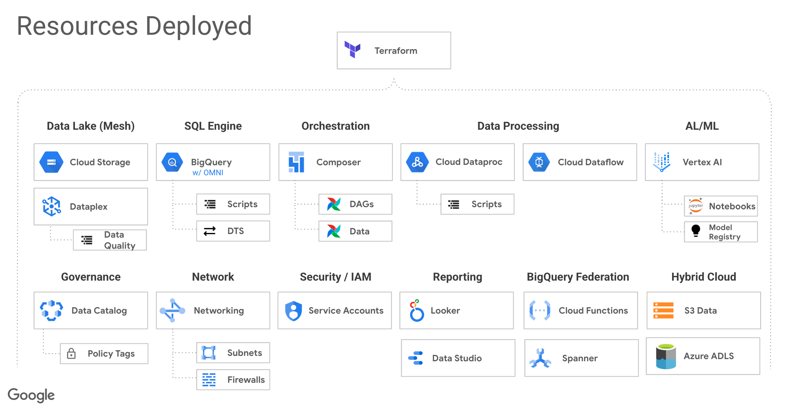
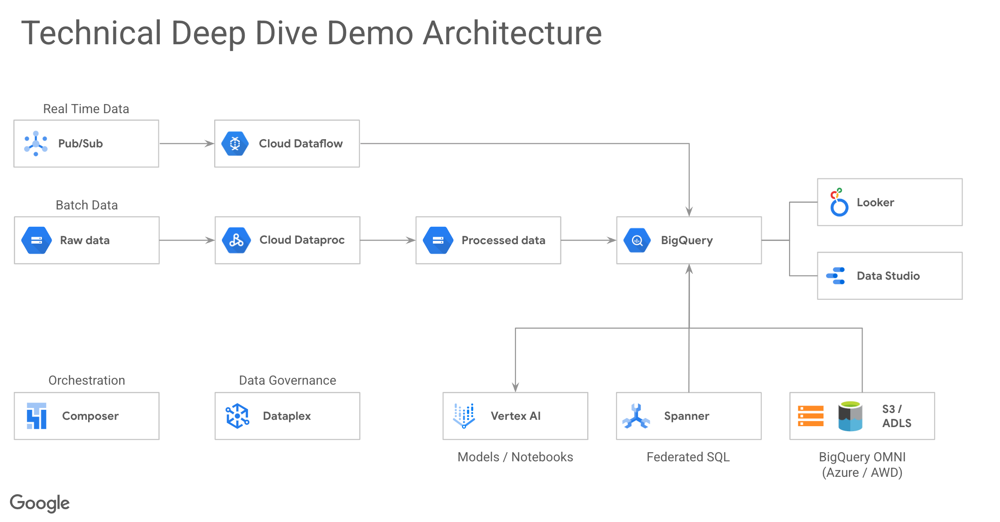
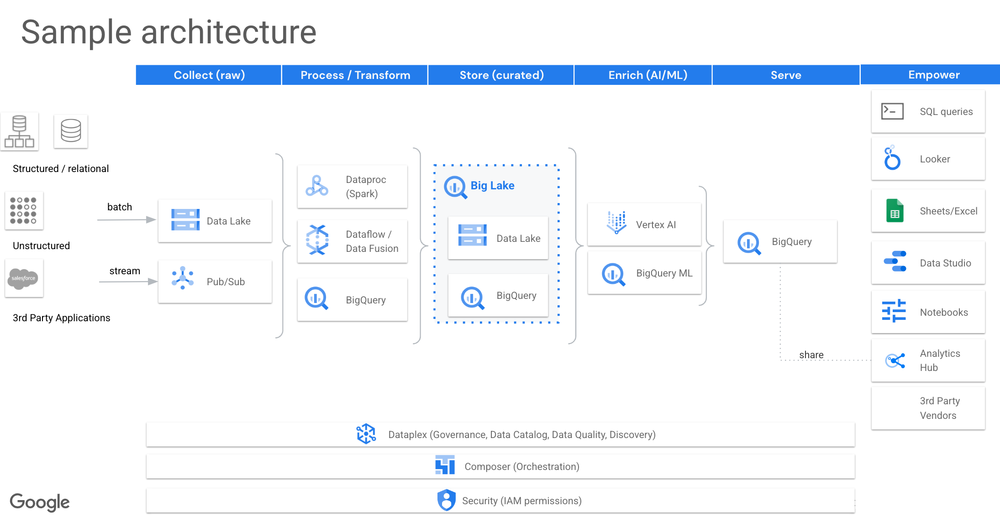
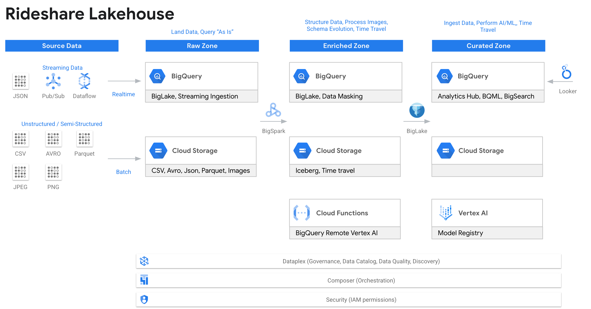
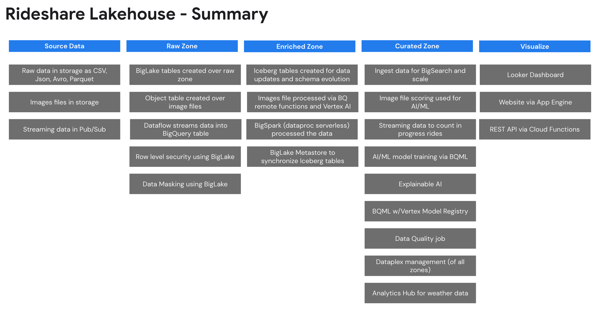

# Data-Analytics-Golden-Demo
Deploys an end-to-end Data Analytics technical walkthrough on Google Cloud.  All the services are connected, configured and ready to run.  The deployed artifacts can be run in any order letting you set your own path through the system.  The system has 70 to 700+ million rows of data so that you can show "true life" performance, scale and integration of various services.  The system orchestates itself using Airflow, communicates over private IP addresses and has working code to demonstrate how to build an end to end system.

## Monthly Video Update (October 2023)

[](https://youtu.be/asZhcFwiVnU)

Prior Months
- [September 2023](https://youtu.be/7I3jw-nNMC8)
- [August 2023](https://youtu.be/QGJYd_6NslU)
- [July 2023](https://youtu.be/Ljbvpg-tZEM)
- [June 2023](https://youtu.be/nTJAxm8oiF4)
- [May 2023](https://youtu.be/VAIBgDPC-w8)


## Demo Artifacts



## Table of Contents (All Links and Videos are coming soon)
|Category|Title|Description|Link|Video||
|---|---|---|---|---|---|
| Ready-To-Go Demos | Rideshare Plus (AI Lakehouse - LLMs)| A new end to end demo where we use our text-bison (PaLM) LLM directly within BigQuery to read customer reviews and extract various pieces of data from each review.  The data will then be used to create a complete employee and customer profile form this data.  At the same time qualitative data analysis will be done and added to each profile.  The demo highlight how LLMs can work with text data and create valuable analytics from the context.  Please view the new Cloud Run website along with the following notebook to run the demo. | [Link](https://github.com/GoogleCloudPlatform/data-analytics-golden-demo/blob/main/colab-enterprise/rideshare-llm/rideshare_llm_ai_lakehouse_demo.ipynb) | [Video](https://youtu.be/-ka9ya_KJAc)
| | Rideshare Plus (AI Lakehouse - Predict and Streaming)|This is an end to end demo of an AI Lakehouse.  The demo goes through the creation of a fictitious company that wants to predict high value rides for rideshare drivers.  The demo takes you through the process from the raw zone to the curated zone and highlights our analytics stack.| [Link](https://github.com/GoogleCloudPlatform/data-analytics-golden-demo/blob/main/sql-scripts/rideshare_lakehouse_curated/sp_demo_script.sql) | [Video](https://youtu.be/Yru78Pk1jMM) |
| | BigQuery Technical Overview | See some top features in BigQuery.  We will explore loading data into BigQuery, streaming data directly into BigQuery, using change data capture with BigQuery and even federated queries with Spanner.  We will then explore data governance, data quality, security and data lineage.  After we have clean and secure data we will build some machine learning models, search billions of rows and explore unstructured data analytics.  Finally, we will explore BigQuery’s serverless infrastructure which includes autoscaling along with various monitoring tools.  | [Link](https://github.com/GoogleCloudPlatform/data-analytics-golden-demo/blob/main/sql-scripts/taxi_dataset/sp_demo_technical_overview.sql) | [Video](https://youtu.be/bMS4p2XHMpE) |
| | High Level Overview Demo | The high level overview highlights some key features: Looker, BigQuery, Analytics Hub, OMNI, BQML. | Link | Video |
| | Technical Demo 1 | This shows: Data Lake, Dataplex, Data Catalog, BigQuery, BQML, BigQuery security and Jupyter notebooks. | Link | Video |
| How to Deploy | Cloud Shell | You can deploy the demo via cloud shell to either a new project or an existing project | [Link](#deploy) | Video |
| Overview / Analytics | Analytic Queries | Use advanced SQL (rank, partition, pivot) to show BigQuery’s ability to perform analytics at scale (70 to 700 million rows of data). | [Link](https://github.com/GoogleCloudPlatform/data-analytics-golden-demo/blob/main/sql-scripts/taxi_dataset/sp_demo_bigquery_queries.sql) | Video |
| | Materialized Views | Show using materializes to speed up your queries, provide automatically query substitution and re-clustering of data. | [Link](https://github.com/GoogleCloudPlatform/data-analytics-golden-demo/blob/main/sql-scripts/taxi_dataset/sp_demo_materialized_views_joins.sql) | Video |
| | Transactions | Show performing a transaction with a try..catch block as well as understand snapshot isolation. | [Link](https://github.com/GoogleCloudPlatform/data-analytics-golden-demo/blob/main/sql-scripts/taxi_dataset/sp_demo_transactions.sql) | Video |
| | Json Datatype | Show ingesting and querying JSON data in BigQuery using the  native JSON data type. | [Link](https://github.com/GoogleCloudPlatform/data-analytics-golden-demo/blob/main/sql-scripts/taxi_dataset/sp_demo_json_datatype.sql) | Video |
| Data Ingestion / Table Creation | Ingest Data | Load (and export) data using UI, LOAD SQL command, CLI and export data. | [Link](https://github.com/GoogleCloudPlatform/data-analytics-golden-demo/blob/main/sql-scripts/taxi_dataset/sp_demo_ingest_data.sql) | Video |
| | Streaming Ingestion | Stream data directly into BigQuery and perform machine learning on the data. | [Link](https://github.com/GoogleCloudPlatform/data-analytics-golden-demo/blob/main/sql-scripts/taxi_dataset/sp_demo_taxi_streaming_data.sql) | Video |
| | Internal Table | Create and load tables in BigQuery using partitioning and clustering.  Shows specifying schema and using schema provided by parquet files. | [Link](https://github.com/GoogleCloudPlatform/data-analytics-golden-demo/blob/main/sql-scripts/taxi_dataset/sp_create_taxi_internal_tables.sql) | Video |
| | Internal / External table join | Shows that you can join an internal and external table. | [Link](https://github.com/GoogleCloudPlatform/data-analytics-golden-demo/blob/main/sql-scripts/taxi_dataset/sp_demo_internal_external_table_join.sql) | Video |
| | Data Transfer Service | Shows how to create and runs a DTS job that does a dataset copy from a public dataset.  All the configuration of DTS in done in the Terraform template.  This will ingest 650 million rows of data. | [Link](https://github.com/GoogleCloudPlatform/data-analytics-golden-demo/blob/main/sql-scripts/taxi_dataset/sp_demo_data_transfer_service.sql) | Video |
| Security / Data Sharing | BigQuery Security | Show granting access to tables, row/column level security, authorized views, data masking and more. | [Link](https://github.com/GoogleCloudPlatform/data-analytics-golden-demo/blob/main/sql-scripts/taxi_dataset/sp_demo_security.sql) | Video |
| | Column Encryption / Crypto Shredding | Show using the AEAD function for column level encryption and see how to use for crypto-shredding | [Link](https://github.com/GoogleCloudPlatform/data-analytics-golden-demo/blob/main/sql-scripts/taxi_dataset/sp_demo_security_col_encryption_shredding.sql) | Video |
| BigSpark | PySpark Data Export | Show running spark code in BigQuery.  This example will export data using hive partitions. | [Link](https://github.com/GoogleCloudPlatform/data-analytics-golden-demo/blob/main/preview-features-public/sp_demo_bigspark_read_bq_save_hive_on_data_lake.sql) | Video |
| | PySpark Data Import | Show Spark loading/ETL data into BigQuery.  Read a CSV file, add a column and write to BigQuery. | [Link](https://github.com/GoogleCloudPlatform/data-analytics-golden-demo/blob/main/preview-features-public/sp_demo_bigspark_read_csv_load_bq_table.sql) | Video |
| | BigSpark with Iceberg Metastore | Learn how to use Iceberg with BigLake Metastore.  This will process data and create Iceberg tables with BigSpark.  The tables will also be placed in BigQuery. | [Link](https://github.com/GoogleCloudPlatform/data-analytics-golden-demo/blob/main/sql-scripts/rideshare_lakehouse_enriched/sp_iceberg_spark_transformation.sql) | Video |
| BigQuery Machine Learning (BQML) | Anomaly Detection | Want to run Anomaly Detection on Fares to see if things are not looking right? | [Link](https://github.com/GoogleCloudPlatform/data-analytics-golden-demo/blob/main/sql-scripts/taxi_dataset/sp_demo_machine_learning_anomaly_fee_amount.sql) | Video |
| | Jupyter Notebook Creating TensorFlow model | Use a Jupyter Notebook to create a TensorFlow that will then be imported into BigQuery. See "Importing TensorFlow model into BigQuery" to import the model. | [Link](https://github.com/GoogleCloudPlatform/data-analytics-golden-demo/blob/main/colab-enterprise/taxi-dataset-demo/BigQuery-Create-TensorFlow-Model.ipynb) | Video |
| | Importing TensorFlow model into BigQuery | Import a model into BigQuery, score data, compare results to notebook.  This is a great way to score data without data movement. | [Link](https://github.com/GoogleCloudPlatform/data-analytics-golden-demo/blob/main/sql-scripts/taxi_dataset/sp_demo_machine_learning_import_tensorflow.sql) | Video |
| | Predicting Taxi Tip Amounts using Linear Regression | Predict tip amounts for each cab ride. Show how easy it is to build a quick model in BigQuery. | [Link](https://github.com/GoogleCloudPlatform/data-analytics-golden-demo/blob/main/sql-scripts/taxi_dataset/sp_demo_machine_learning_tip_amounts.sql) | Video |
| | Easily query BigQuery from Jupyter notebooks | Data scientists need to be able to query BigQuery quickly and easily.  This shows how they can access the data in BigQuery with ease. | [Link](https://github.com/GoogleCloudPlatform/data-analytics-golden-demo/blob/main/colab-enterprise/taxi-dataset-demo/BigQuery-Demo-Notebook.ipynb) | Video |
| BigSearch | 5 Billion Rows | Run BigSearch on 5 billion rows of log files (5 TB).  Compare to a non-indexed table. | [Link](https://github.com/GoogleCloudPlatform/data-analytics-golden-demo/blob/main/sql-scripts/taxi_dataset/sp_demo_bigsearch.sql) | Video |
| | 50 Billion Rows | Run on 50 billion rows of data (60 TB) to show our indexing performance at scale.  Currently internal since this is a lot of data. | Link | Video |
| BigLake | BigLake tables with Security | See how to create a BigLake table and secure it with row and column level access. | [Link](https://github.com/GoogleCloudPlatform/data-analytics-golden-demo/blob/main/sql-scripts/taxi_dataset/sp_demo_biglake.sql) | Video |
| | Unstructured data analytics using Object tables | DESC | [Link](https://github.com/GoogleCloudPlatform/data-analytics-golden-demo/blob/main/sql-scripts/taxi_dataset/sp_demo_biglake_unstructured_data.sql) | Video |
| | Query Acceleration | Accelerate your data lake queries by caching your file metadata in BigQuery. | [Link](https://github.com/GoogleCloudPlatform/data-analytics-golden-demo/blob/main/sql-scripts/taxi_dataset/sp_demo_biglake_query_acceleration.sql) | Video |
| | Iceberg format | See how to read Iceberg files in BigQuery | [Link](https://github.com/GoogleCloudPlatform/data-analytics-golden-demo/blob/main/sql-scripts/taxi_dataset/sp_demo_biglake_iceberg.sql) | Video |
| | BigLake Metastore (security) | End to end demo of setting up BigLake Metastore show each and every security detail. | [Link](https://github.com/GoogleCloudPlatform/data-analytics-golden-demo/blob/main/sql-scripts/taxi_dataset/sp_demo_biglake_metastore_security.sql) | [Video](https://youtu.be/IQR9gJuLXbQ) |
| OMNI (AWS) w/BigLake | Create tables in AWS | See how to create BigLake tables on hive based directory structure on csv, json and parquet. | [Link](https://github.com/GoogleCloudPlatform/data-analytics-golden-demo/blob/main/sql-scripts/aws_omni_biglake/sp_demo_aws_omni_create_tables.sql) | Video |
| | Read Delta Lake | See how to use the delta.io manifest files to read delta format on AWS. | [Link](https://github.com/GoogleCloudPlatform/data-analytics-golden-demo/blob/main/sql-scripts/aws_omni_biglake/sp_demo_aws_omni_delta_lake.sql) | Video |
| | Cross Cloud Database Joins | Shows how we can query data in AWS and join to data in GCP using BigQuery OMNI.   Also, we join to all three clouds.| [Link](https://github.com/GoogleCloudPlatform/data-analytics-golden-demo/blob/main/sql-scripts/aws_omni_biglake/sp_demo_aws_omni_queries_cross_cloud.sql) | [Video](https://youtu.be/tHjG8tmDoWk) |
| | Query / Export / Load | See how to write queries on the AWS data, export results to S3 and transfer results back to the Google Cloud. | [Link]() | Video |
| | TITLE | DESC | [Link](https://github.com/GoogleCloudPlatform/data-analytics-golden-demo/blob/main/sql-scripts/aws_omni_biglake/sp_demo_aws_omni_queries.sql) | Video |
| | Column Level Security | Create column level security on AWS tables | [Link](https://github.com/GoogleCloudPlatform/data-analytics-golden-demo/blob/main/sql-scripts/aws_omni_biglake/sp_demo_aws_omni_security_cls.sql) | Video |
| | Row Level Security | Create row level security on AWS Tables | [Link](https://github.com/GoogleCloudPlatform/data-analytics-golden-demo/blob/main/sql-scripts/aws_omni_biglake/sp_demo_aws_omni_security_rls.sql) | Video |
| OMNI (Azure) w/BigLake | Create tables in Azure | See how to create BigLake tables on hive based directory structure on csv, json and parquet. | [Link](https://github.com/GoogleCloudPlatform/data-analytics-golden-demo/blob/main/sql-scripts/azure_omni_biglake/sp_demo_azure_omni_create_tables.sql) | Video |
| | Read Delta Lake | See how to use the delta.io manifest files to read delta format on Azure. | [Link](https://github.com/GoogleCloudPlatform/data-analytics-golden-demo/blob/main/sql-scripts/azure_omni_biglake/sp_demo_azure_omni_delta_lake.sql) | Video |
| | Cross Cloud Database Joins | Shows how we can query data in Azure and join to data in GCP using BigQuery OMNI.   Also, we join to all three clouds.| [Link](https://github.com/GoogleCloudPlatform/data-analytics-golden-demo/blob/main/sql-scripts/azure_omni_biglake/sp_demo_azure_omni_queries_cross_cloud.sql) | [Video](https://youtu.be/tHjG8tmDoWk) |
| | Query / Export / Load | See how to write queries on the Azure data, export results to ADLS Gen 2 and transfer results back to the Google Cloud. | [Link](https://github.com/GoogleCloudPlatform/data-analytics-golden-demo/blob/main/sql-scripts/azure_omni_biglake/sp_demo_azure_omni_queries.sql) | Video |
| | Column Level Security | Create column level security on Azure tables | [Link](https://github.com/GoogleCloudPlatform/data-analytics-golden-demo/blob/main/sql-scripts/azure_omni_biglake/sp_demo_azure_omni_security_cls.sql) | Video |
| | Row Level Security | Create row level security on Azure Tables | [Link](https://github.com/GoogleCloudPlatform/data-analytics-golden-demo/blob/main/sql-scripts/azure_omni_biglake/sp_demo_azure_omni_security_rls.sql) | Video |
| Dataplex | Dataplex | Deploy Dataplex and have your data lakes setup and configured so you can demo Dataplex. | [Link](https://github.com/GoogleCloudPlatform/data-analytics-golden-demo/blob/main/cloud-composer/dags/sample-dataplex-deploy.py) | Video |
| | Dataplex Explore with Metastore (HMS) | Deploy Dataplex with a Dataproc Metastore so you can demo the Explore feature of Dataplex.  This includes a Spark SQL script and a notebook. | [Link](https://github.com/GoogleCloudPlatform/data-analytics-golden-demo/blob/main/dataplex/data-explore/dataplex-explore-script.sql) | [Video](https://youtu.be/l_UKjNIR_eg) |
| | Data Quality | Run a data quality check on your data to ensure data integrity and verify various conditions are meet.  The results are then published to data catalog. | [Link](https://github.com/GoogleCloudPlatform/data-analytics-golden-demo/blob/main/cloud-composer/dags/sample-dataplex-run-data-quality.py) | Video |
| BigQuery Features | External Functions | Call an External Cloud Function that scores data using our Vision API. | [Link](https://github.com/GoogleCloudPlatform/data-analytics-golden-demo/blob/main/sql-scripts/taxi_dataset/sp_demo_external_function.sql) | Video |
| | Federated Query | Show how you can query Spanner directly from BigQuery and join the data across systems. | [Link](https://github.com/GoogleCloudPlatform/data-analytics-golden-demo/blob/main/sql-scripts/taxi_dataset/sp_demo_federated_query.sql) | Video |
| | Time Travel / Snapshots | Show time travel and the ability to snapshot a table in time | [Link](https://github.com/GoogleCloudPlatform/data-analytics-golden-demo/blob/main/sql-scripts/taxi_dataset/sp_demo_time_travel_snapshots.sql) | Video |
| | Delta.io | Read delta.io files using manifest files.  Native support is on its way!. | [Link](https://github.com/GoogleCloudPlatform/data-analytics-golden-demo/blob/main/sql-scripts/taxi_dataset/sp_demo_delta_lake_using_manifest.sql) | [Video](https://youtu.be/wLKlR211FUc) |
| | Delta.io | Read delta.io files using a workaround. | [Link](https://github.com/GoogleCloudPlatform/data-analytics-golden-demo/blob/main/sql-scripts/taxi_dataset/sp_demo_delta_lake_using_workaround.sql) | Video |
| | Analytics Hub - Setup Data Sharing Demo | Setup your own publisher and test a subscriber across organizations with RLS security. | Link | Video |
| | Analytics Hub - Consuming Publisher Data | Show Analytics Hub and a query use case for sharing data between an eCommerce site and a supplier. | Link | Video |
| Pricing / Costs | Pricing | Show the aspects of pricing/slots and how to control costs and view costs | [Link](https://github.com/GoogleCloudPlatform/data-analytics-golden-demo/blob/main/sql-scripts/taxi_dataset/sp_demo_pricing.sql) | [Video](https://youtu.be/PPF8wBjJOxU) |
|   | On-Demand Usage Analysis |  Analyze your queries run within your entire Organization to see which on-demand queries are costing the most.  The analysis will highlight your costs for the queries and suggest which projects you should consider switching to slots. | [Link](https://github.com/GoogleCloudPlatform/data-analytics-golden-demo/blob/main/sql-scripts/taxi_dataset/sp_demo_pricing_ondemand_usage.sql) | [Video](https://www.youtube.com/watch?v=3zPLyWlZ020) |
| Dataform | Dataform Demo | Perform an ETL with Dataform using data streamed into a table from Pub/Sub and join lookup data with a BigLake table.  Also, shows Git integration. | [Link](https://github.com/GoogleCloudPlatform/data-analytics-golden-demo/blob/main/sql-scripts/taxi_dataset/sp_create_demo_dataform.sql) | Video |
| Datastream | Private IP Demo | Show changed data capture (10 million rows) from a Cloud SQL (Postgres) database to BigQuery over Private Service Connectivity (no public IP addresses) | [Link](https://github.com/GoogleCloudPlatform/data-analytics-golden-demo/blob/main/sql-scripts/taxi_dataset/sp_demo_datastream_private_ip.sql) | [Video](https://youtu.be/ow17MIXHOqw) |
|  | Public IP Demo | Show changed data capture (10 million rows) from a Cloud SQL (Postgres) database to BigQuery over a Public IP address | [Link](https://github.com/GoogleCloudPlatform/data-analytics-golden-demo/blob/main/sql-scripts/taxi_dataset/sp_demo_datastream_public_ip.sql) | [Video](https://youtu.be/ow17MIXHOqw) |
| Customize |  | Add you own items to the demo using Terraform.  Follow the below pattern to add your own features to the demo without going through the work of provisioning an entire environment with lots of test data. |  | [Video](https://youtu.be/2Qu29_hR2Z0) |
|  | DAG | The DAG sample-terraform-bucket-demo-deploy.py is a sample you can use as a template. The DAG does both the deploy and destroy.  By replacing the word deploy with destroy in the filename, the DAG will become a destroy DAG.  You simply need to upload the same file twice to Airflow, one with a deploy and one with a destroy filename. | [Link](https://github.com/GoogleCloudPlatform/data-analytics-golden-demo/blob/main/cloud-composer/dags/sample-terraform-bucket-demo-deploy.py) | See above |
|  | Terraform | This is sample Terraform you can copy.  You need to ensure you pass in the project_id and the impersonate_service_account in the variables file [Link](https://github.com/GoogleCloudPlatform/data-analytics-golden-demo/tree/main/cloud-composer/data/terraform/bucket-demo) | [Link](https://github.com/GoogleCloudPlatform/data-analytics-golden-demo/tree/main/cloud-composer/data/terraform/bucket-demo) | See above |
|  | Script | This is the bash script that is called by the DAG.  You will need to change these lines to pass in your Terraform custom parameters [Link](https://github.com/GoogleCloudPlatform/data-analytics-golden-demo/blob/main/cloud-composer/data/sample_terraform_bucket_demo.sh#L97-L102). | [Link](https://github.com/GoogleCloudPlatform/data-analytics-golden-demo/blob/main/cloud-composer/data/sample_terraform_bucket_demo.sh) | See above |

## Deploy
### Demo Cost
- The demo costs about $20 USD a day to run or $2 USD per day if you remove Composer.
- Several of the demos start up a service and then shut it down after 4 hours via Airflow automation to save on costs.
- To save on costs you can delete Composer since it costs ~$17 USD per day.
  - Once you remove Composer cost drops to ~$2 USD per day. 
  - You will lack the automation Composer provides.
  - You would want to run any DAGs you are interested in deploying before removing Composer.
  

## Diagrams












## Deploy

[](https://shell.cloud.google.com/cloudshell/?terminal=true&show=terminal&cloudshell_git_repo=https%3A%2F%2Fgithub.com%2FGoogleCloudPlatform%2Fdata-analytics-golden-demo)

After the repo is cloned you would type ```source deploy.sh``` to deploy.

### To deploy to New Project (Requires Elevated Privileges)
- Deployment [Video](https://youtu.be/QvCCo35qgys)
- Post Deployment Verification [Video](https://youtu.be/r1mp4Yve0VY)
- **The following IAM roles are required to deploy the solution**
   - Prerequisite:  Billing Account User (to create the project with billing)
   - Prerequisite:  Organization Administrator (to create all assets)
   - Prerequisite:  Organization Policy Administrator (to change org policies)
   - Optional:      Folder Editor (if you alter the script to place the project in a folder)
1. Open a Google Cloud Shell: http://shell.cloud.google.com/
2. Type: ```git clone https://github.com/GoogleCloudPlatform/data-analytics-golden-demo```
3. Switch the prompt to the directory: ```cd data-analytics-golden-demo```
4. Run the deployment script: ```source deploy.sh```
5. Authorize the login (a popup will appear)
6. Follow the prompts: Answer “Yes” for the Terraform approval.


### To deploy to an Existing Project (Requires Assistance from IT and Owner Project Privileges)
- Deployment [Video](https://youtu.be/SLzr737SHXM)
- Post Deployment Verification [Video](https://youtu.be/r1mp4Yve0VY)
- **The following items are required to deploy the solution**
   - Prerequisite: You will need a project created for you (IT can do this for you)
   - Prerequisite: You will need to be an Owner (IAM role) of the project to run the below script
   - Prerequisite: You will need an Organization Policy Administrator to disable the following Org Policies (IT can do this for you)
      - requireOsLogin = false
      - requireShieldedVm = false
      - allowedIngressSettings = allow all
      - allowedPolicyMemberDomains = allow all
      - restrictVpcPeering = allow all
1. Open a Google Cloud Shell: http://shell.cloud.google.com/
2. Type: ```git clone https://github.com/GoogleCloudPlatform/data-analytics-golden-demo```
3. Switch the prompt to the directory: ```cd data-analytics-golden-demo```
4. Update the hard coded values in ```deploy-use-existing-project-non-org-admin.sh```
5. Run ```source deploy-use-existing-project-non-org-admin.sh```
6. Your Organization Policy Administrator can then reenable the following Organization Policies
   - (DO NOT RE-ENABLE) requireOsLogin = false
   - (RE-ENABLE) requireShieldedVm = false
   - (RE-ENABLE) allowedIngressSettings = allow all
   - (RE-ENABLE) allowedPolicyMemberDomains = allow all
   - (RE-ENABLE) restrictVpcPeering = allow all


### To deploy the project to a different region
1. By default the solution deploys to us-west{x} region and US (multi-region)
2. To deploy to another region review the code in [deploy-europe-region.sh](deploy-europe-region.sh)
3. You can run either of the above deployment methods.  Copy the Terraform  "region" parameters to either of the above scripts.


### After the deployment
- Open Cloud Composer
- Open the Airflow UI
- You will see the Run-All-Dags DAG running
   - This will run the DAGs needed to seed the project with data
   - Once the DAG is complete, you can run the solution


### Possible  Deployment Errors:
1. If the script fails to enable a service or timeouts, you can rerun and if that does not work, run ```source clean-up.sh``` and start over
2. If the script has a security type message (unauthorized), then double check the configure roles/IAM security.  Your user account is probably not an Owner of the project or Org Admin if creating the project.
3. When using Cloud Shell: If you get a "networking error" with some dial tcp message [2607:f8b0:4001:c1a::5f], then your cloud shell has a networking glitch, not the Terraform network.  Restart the deployment "source deploy.sh". (e.g. Error creating Network: Post ```https://compute.googleapis.com/compute/beta/projects/bigquery-demo-xvz1143xu9/global/networks?alt=json```: dial tcp [2607:f8b0:4001:c1a::5f]:443: connect: cannot assign requested address).  This typically happens on WiFi.


## Folders
- cloud-composer
   - dags - all the DAGs for Airflow which run the system and seed the data
   - data - all the bash and SQL scripts to deploy
   - dataflow
 - dataflow 
   - Dataflow job that connects to the public Pub/Sub sample streaming taxi data.  You start this using composer.
- dataproc
   - Spark code to that is used to process the initial downloaded data
- colab-enterprise
   - Sample notebooks that can be run in Vertex AI.  To create the managed notebook, use the DAG in composer.
   - sql-scripts
 - sql-scripts
   - The BigQuery SQL sample scripts. These are currently deployed as stored procedures.  You can edit each stored procedure and run the sample code query by query.
- terraform
   - The entry point for when deploying via cloud shell or your local machine.  This uses service account impersonation.
- terraform-modules
   - api - enables the GCP apis
   - org-policies - sets organization policies at the project level that have to be "disabled" to deploy the resources.
   - org-policies-destroy - commented out org policies so we can revert the org policies back to their original state.
   - project - creates the cloud project if a project number is not provided
   - resources - the main set of resources to deploy
   - service-account - creates a service account if a project numnber is not provided.  The service account will be impersonated during the deployment.
   - service-usage - enables the service usage API as the main user (non-impersonated)
   - sql-scripts - deploys the sql scripts
