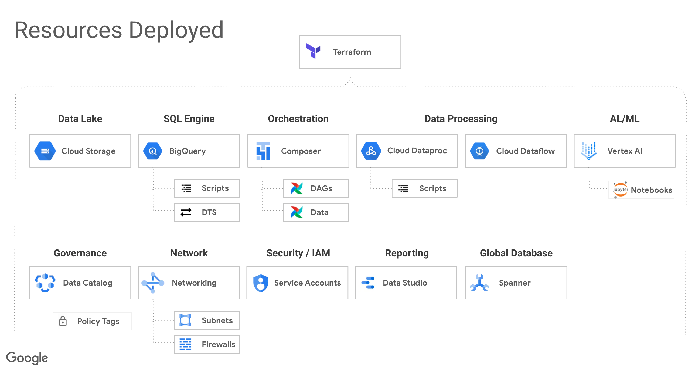

# Enterprise-Data-Analytics-Demo
Deploys a end to end working demo of a Data Analytics / Data Processing using Google Cloud.  All the services are connected, configured and ready to run.  All the artifacts are deployed and you can immedately start using.

## Deploying using Cloud Shell
You can deploy this to a new project or an existing project.
- New Project:
  - This requires you to be an Org Admin.  This is a great for personal projects or if IT is running the script.
- Existing Project:
  - This requires a project to be created in advance.  IT typically will create and provide a service account which is used to deploy.  Or IT can allow you to impersonate the service account (more secure then exporting a JSON credential file)

### To deploy to New Project (Preferred method)
1. Open a Google Cloud Shell: http://shell.cloud.google.com/ 
2. Type: git clone https://github.com/GoogleCloudPlatform/enterprise-data-analytics-demo.git
3. Switch the prompt to the directory: cd enterprise-data-analytics-demo
4. Run the deployment script: source deploy.sh  
5. Authorize the login (a popup will appear)
6. Follow the prompts: Answer “Yes” for each.

### To deploy to an Existing Project
1. Review the code in the deploy-use-existing-project.sh
2. You should have a project and a service account with the Owner role
3. You will just hard code the project and service account information into the script.  The script has code in it to "emualte" someone else creating a project.  

### After the deployment
1. Open Cloud Composer.  You will see the Run-All-Dags DAG running.  This will download 3 years of taxi data and place in Google Storage, then process the data with Dataproc (Spark) and then deploy all the BigQuery stored procedures (sample code)
2.  After the DAG is complete head over to BigQuery and execute the stored procedure "sp_create_taxi_external_tables".  This will create BigQuery tables for you to explore the data.  Read the top of the stored procedure for notes and review the code.
3. Once you have the external tables created, run the stored procedure sp_create_taxi_internal_tables.  You are now ready to run the rest of the demo.  You can run it in any order and each stored procedure script has an undo script at the top.
4.  You should also head over to Vertex AI and workbench.  Open Managed Notebooks and then browse to the stored account (notebooks folder).  There are some sample notebooks to do machine learning and BigQuery exploration.

### Possible Errors:
1. If the script fails to enable a service or timeouts, you can rerun and if that does not work, run ./clean.sh and start over
2. If the script has security type message (unauthorized), then double check the configure roles/IAM security.
3. If you get the error "Error: Error when reading or editing Project Service : Request `List Project Services bigquery-demo-xxxxxxxxx` returned error: Failed to list enabled services for project bigquery-demo-xxxxxxxxx: Get "https://serviceusage.googleapis.com/v1/projects/bigquery-demo-xxxxxxxxx/services?alt=json&fields=services%2Fname%2CnextPageToken&filter=state%3AENABLED&prettyPrint=false".  You need to start over.  Run ./clean.sh and then run source deploy.sh again.  This is due to the service usage api not getting propagated with 4 minutes...
  - Delete your failed project

## Folders
- cloud-composer
  - dags - all the DAGs for Airflow which run the system and seed the data
  - data - all the bash and SQL scripts to deploy
- dataproc
  - the Spark SQL code
- terraform
  - the entry point for when deploying this using a service account 
- terraform-modules
  - project - creates the cloud project if a project number is not provided
  - resouces - the main set of resources to deploy
  - service-account - creates a service account if a project numnber is not provided.  The service account will be impersonated during the deployment.
  - service-usage - enables the service usage API as the main user (non-impersonated)
- terraform-local
  - the entry point for when deploying via cloud shell or your local machine.  This uses service account impersonation