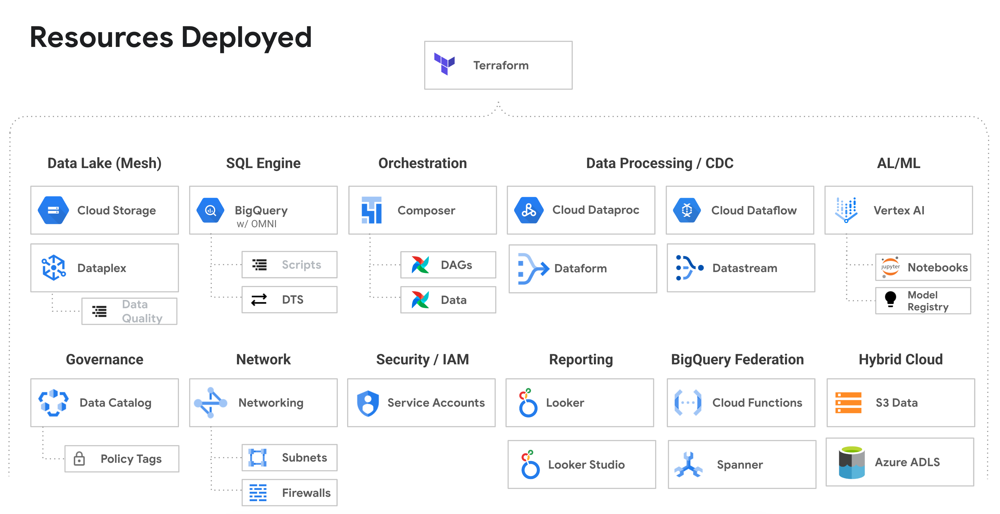

# Data-Analytics-Golden-Demo
Deploys a end to end working demo of a Data Analytics / Data Processing using Google Cloud.  All the services are connected, configured and ready to run.  All the artifacts are deployed and you can immedately start using.





### To deploy to New Project (Preferred method - You must be an Org Admin)
1. Open a Google Cloud Shell: http://shell.cloud.google.com/ 
2. Type: ```git clone https://github.com/GoogleCloudPlatform/data-analytics-golden-demo```
3. Switch the prompt to the directory: ```cd data-analytics-golden-demo```
4. Run the deployment script: ```source deploy.sh```
5. Authorize the login (a popup will appear)
6. Follow the prompts: Answer “Yes” for the Terraform approval.


### To deploy to an Existing Project (as a non-Org Admin)
1. Prerequisite: You will need a project created for you
2. Prerequisite: You will need to be an Owner of the project
3. Prerequisite: You will need an Org Admin to disable the following Org Policies
   - requireOsLogin = false
   - requireShieldedVm = false
   - allowedIngressSettings = allow all
   - allowedPolicyMemberDomains = allow all
4. Open a Google Cloud Shell: http://shell.cloud.google.com/ 
5. Type: ```git clone https://github.com/GoogleCloudPlatform/data-analytics-golden-demo```
6. Switch the prompt to the directory: ```cd data-analytics-golden-demo```
7. Update the hard coded values in ```deploy-use-existing-project-non-org-admin.sh```
8. Run ```source deploy-use-existing-project-non-org-admin.sh```
9. Your Org Admin can then renable the following Org Policies
   - (DO NOT RENABLE) requireOsLogin = false
   - (RENABLE) requireShieldedVm = false
   - (RENABLE) allowedIngressSettings = allow all
   - (RENABLE) allowedPolicyMemberDomains = allow all


### To deploy the project to a different region
1. The project by default deploys to US multi-region, us-central1 and us-west2
2. To deploy to another region review the code in [deploy-europe-region.sh](deploy-europe-region.sh)


### To deploy to an Existing Project (using a service account as an Org Admin)
1. Review the code in the [deploy-use-existing-project.sh](deploy-use-existing-project.sh)
2. You should have a project and a service account with the Owner role
3. You will just hard code the project and service account information into the script.  The script has code in it to "emualte" someone else creating a project.  


### After the deployment
- Open Cloud Composer
- Open the Airflow UI
- You will see the Run-All-Dags DAG running
    - This will run the DAGs needed to see the project with data
    - Once this is done you can run the demo


### Possible Errors:
1. If the script fails to enable a service or timeouts, you can rerun and if that does not work, run ```source clean-up.sh``` and start over
2. If the script has security type message (unauthorized), then double check the configure roles/IAM security.
3. When using Cloud Shell: If you get a "networking error" with some dial tcp message [2607:f8b0:4001:c1a::5f], then your cloud shell had a networking glitch, not the Terraform network.  Restart the deployment "source deploy.sh". (e.g. Error creating Network: Post ```https://compute.googleapis.com/compute/beta/projects/bigquery-demo-xvz1143xu9/global/networks?alt=json```: dial tcp [2607:f8b0:4001:c1a::5f]:443: connect: cannot assign requested address)


## Folders
- cloud-composer
  - dags - all the DAGs for Airflow which run the system and seed the data
  - data - all the bash and SQL scripts to deploy
- dataflow
  - Dataflow job that connects to the public Pub/Sub sample streaming taxi data.  You start this using composer.
- dataproc
  - Spark code to that is used to process the initial downloaded data
- notebooks
  - Sample notebooks that can be run in Vertex AI.  To create the managed notebook, use the DAG in composer.
- sql-scripts
  - The BigQuery SQL sample scripts. These are currently deployed as stored procedures.  You can edit each stored procedure and run the sample code query by query.
- terraform
  - the entry point for when deploying via cloud shell or your local machine.  This uses service account impersonation
- terraform-modules
  - api - enables the GCP apis
  - org-policies - sets organization policies at the project level that have to be "disabled" to deploy the resources.
  - org-policies-deprecated - an older apporach for org policies and is needed when your cloud build account is in a different domain
  - project - creates the cloud project if a project number is not provided
  - resouces - the main set of resources to deploy
  - service-account - creates a service account if a project numnber is not provided.  The service account will be impersonated during the deployment.
  - service-usage - enables the service usage API as the main user (non-impersonated)
  - sql-scripts - deploys the sql scripts
