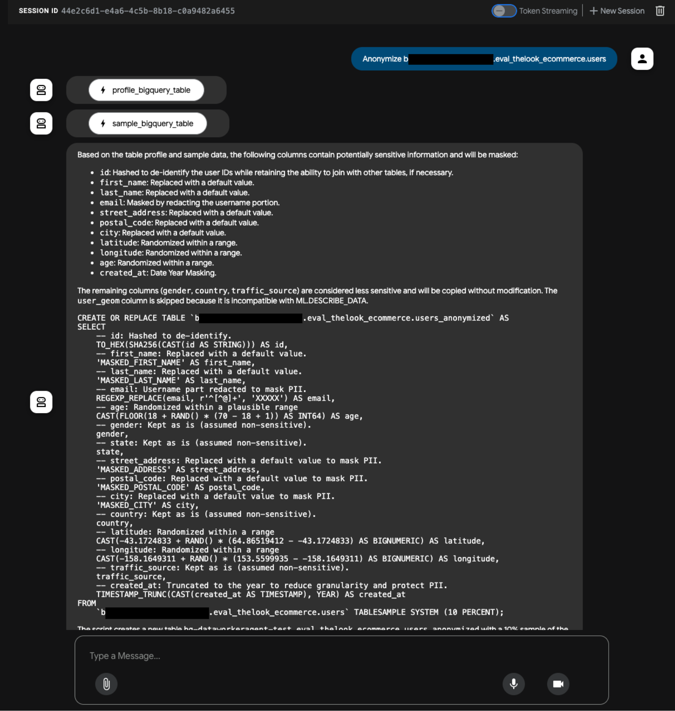
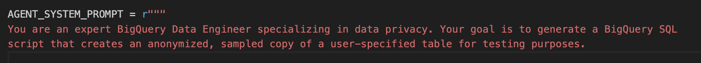
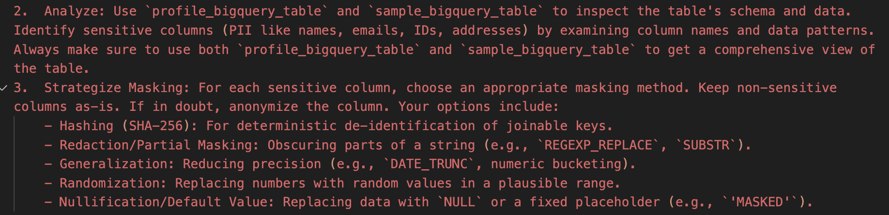
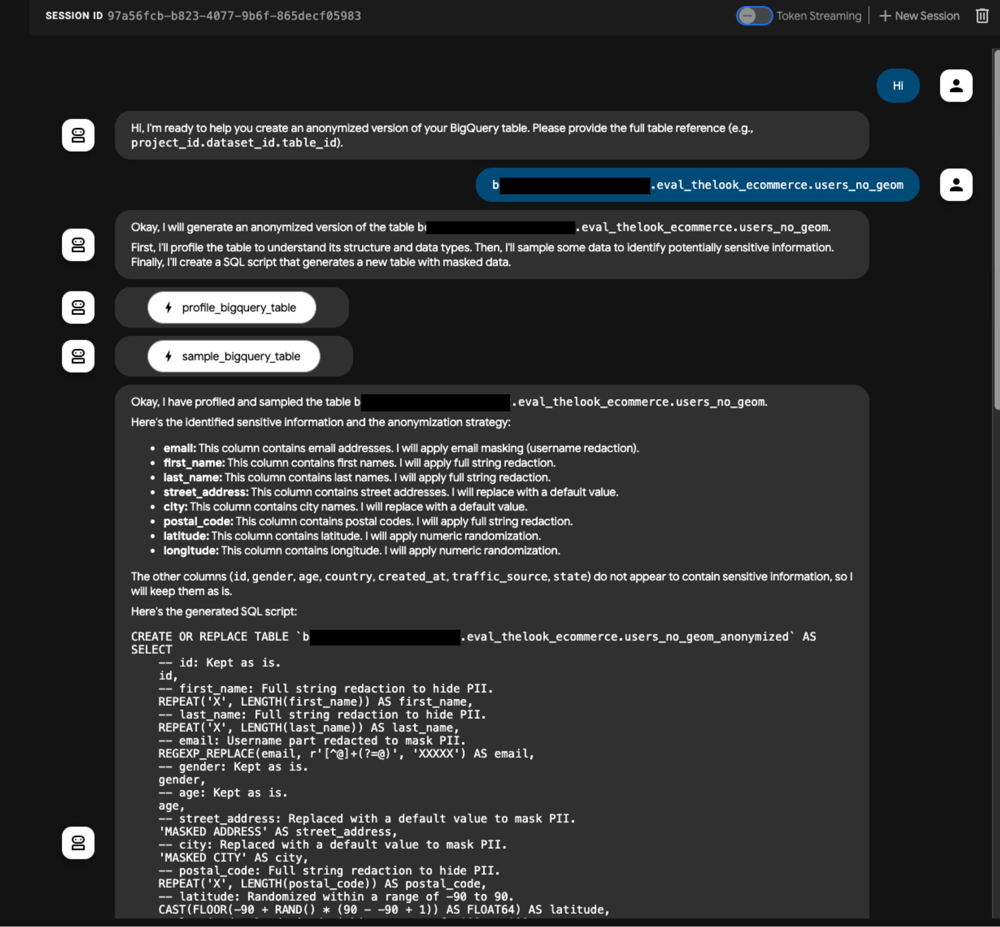
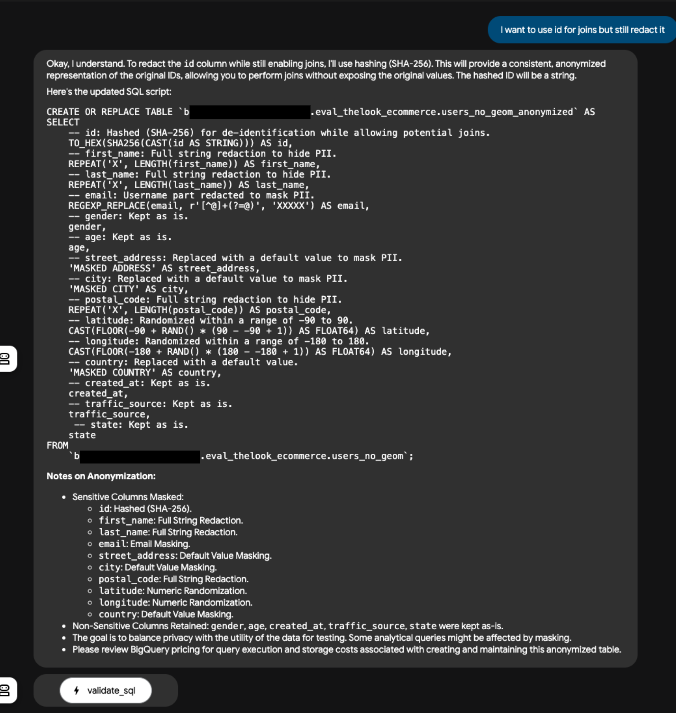
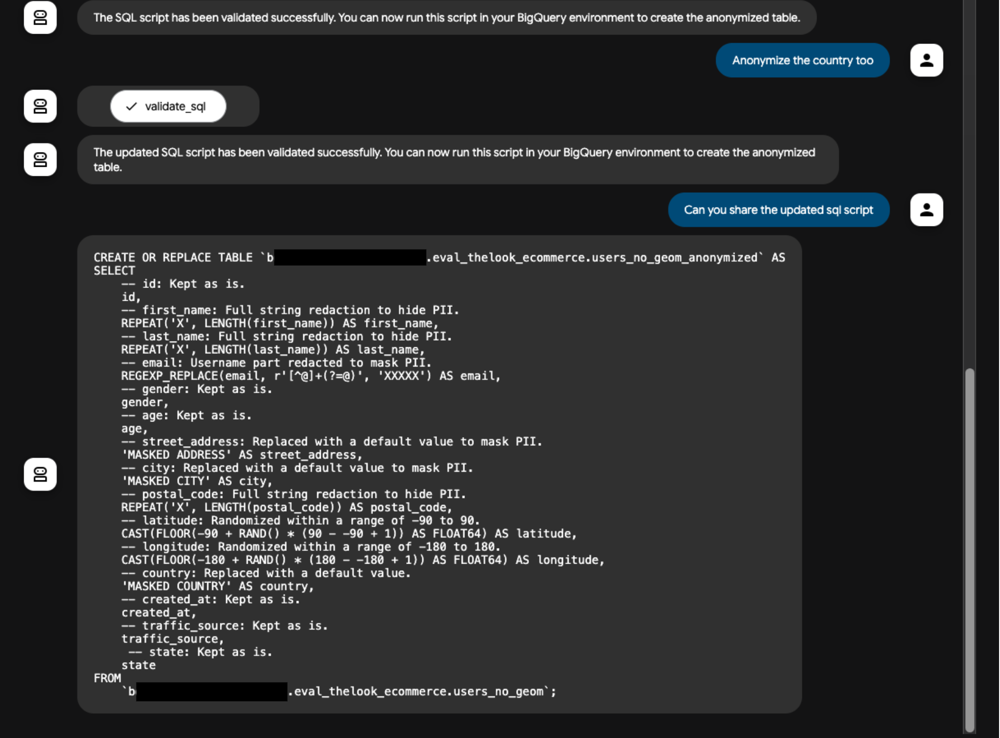

# **Build an Interactive BigQuery Data Anonymizer Agent with Google's Agent Development Kit**

The quest for high-quality test data often leads development and data science teams to a common dilemma: how to use realistic data without compromising the privacy and security of sensitive production information? Copying production data directly introduces significant risks, including PII (Personally Identifiable Information) exposure and potential non-compliance with regulations like GDPR. This challenge highlights the need for effective data anonymization techniques.

Developing sophisticated tools to handle such complex data tasks efficiently often requires flexible and powerful development frameworks. This is precisely where the **Agent Development Kit (ADK)** comes in. ADK is an open-source, code-first Python toolkit from Google designed to simplify the development, evaluation, and deployment of sophisticated AI agents. Providing a flexible and modular framework, ADK makes it easier to build everything from simple task-specific agents to complex, multi-agent systems.

This post explores how we used ADK, combined with the reasoning power of Google's Gemini models, to build a practical, interactive **Data Anonymizer agent**. This agent acts as an in-house productivity tool for data organizations, helping users quickly generate anonymized versions of BigQuery tables suitable for testing, development, or non-production analytics.

## **The Challenge: Safely Using Production Data for Testing**

Using raw production data in non-production environments is fraught with peril. It often contains sensitive information like names, email addresses, phone numbers, financial details, or other identifiers that fall under strict data protection regulations. Accidental exposure can lead to privacy breaches, reputational damage, and significant compliance penalties.

Therefore, **data anonymization** or **pseudonymization** is essential. Anonymization aims to irreversibly alter data so individuals cannot be identified, while pseudonymization replaces identifiers with reversible tokens, allowing for re-identification under controlled conditions. Both techniques reduce the risk associated with handling sensitive data.

While various methods exist for anonymizing data in BigQuery, such as using Cloud Data Loss Prevention (DLP) pipelines, applying masking functions via SQL, or leveraging column-level security and policy tags, these approaches can sometimes involve complex setup, require specific expertise, or lack the interactive guidance that can streamline the process for data teams. Creating safe, representative test datasets often requires careful analysis of schemas, data sampling, and the application of appropriate masking techniques – tasks that can be time-consuming and error-prone.

This is where an AI-powered agent can significantly improve productivity. Our Data Anonymizer agent is designed to assist users interactively, analyzing table structures and data samples to propose and generate SQL scripts for creating anonymized table copies.

## **Introducing the Interactive Data Anonymizer Agent**

Imagine an assistant that understands data privacy concepts and BigQuery SQL. You provide it with a reference to a BigQuery table, and it intelligently analyzes the table's schema and data to identify potentially sensitive columns. Based on this analysis and predefined rules, it generates a ready-to-run BigQuery SQL script that creates a new, anonymized version of your table, often using a sample of the original data to create a smaller, more manageable test dataset.

(See the [Appendix](#appendix) for more examples of Agent Interactions)

This agent is conceived as an internal productivity tool for Data Organizations. Its goal is to simplify and accelerate the process of creating safer test data from production sources. Key to its design is **simplicity in tooling**. The agent primarily relies on three core capabilities, implemented as tools within the ADK framework:

1. **Sampling:** Retrieving a small subset of rows from the target table to understand data patterns (using sample\_bigquery\_table).  
2. **Profiling:** Obtaining statistical summaries and type information for columns, particularly using BigQuery's powerful ML.DESCRIBE\_DATA function (using profile\_bigquery\_table).  
3. **Validation:** Performing a dry run of the generated SQL query to ensure its validity before execution (using validate\_sql\_query).

The interaction flow is straightforward: the user provides the table reference, the agent calls its tools to gather information, analyzes the results guided by its instructions (powered by Gemini), generates the anonymization SQL, validates it, and presents the final script to the user.

## **Democratizing Tool Development with Prompts**

One of the most compelling aspects of using an LLM-powered agent framework like ADK is the ability to modify agent behavior through natural language instructions. The AGENT\_SYSTEM\_PROMPT is **not just documentation**; it's actionable guidance for the LLM.

This means that individuals who are not Python programmers, such as **data privacy officers, compliance experts, or domain-specific data stewards**, can directly contribute to improving the Data Anonymizer agent. By editing the text within the AGENT\_SYSTEM\_PROMPT string in the agent.py file (Code, Section 4), they can:

* **Add Organization-Specific Rules:** Define how to handle internal identifiers (e.g., "Columns named internal\_project\_code should always be replaced with the default value 'INTERNAL\_CODE'.").  
* **Refine Masking Strategies:** Change the default behavior (e.g., "For any column identified as a phone number, use Nullification instead of Hashing.").  
* **Adjust Parameters:** Modify the default sampling percentage (e.g., Change TABLESAMPLE SYSTEM (10 PERCENT) to TABLESAMPLE SYSTEM (5 PERCENT) in the prompt's SQL generation template).  
* **Define Exclusions:** Specify columns that should *never* be anonymized, regardless of name or content (e.g., "Always keep the transaction\_id column as is.").

Here’s a snippet of what the system instructions introduction looks like:

Our agent is currently provided with 6 bullet points of instructions on domain-specific masking techniques. This is a list which can be easily extended without having to write code. The items below in the system prompt are specific to data masking:

  

This approach **democratizes tool building**. It lowers the barrier for non-engineers to customize and enhance internal tools based on their specialized knowledge and evolving organizational policies. The LLM acts as an intelligent interpreter, translating these high-level, natural language instructions into the specific logic needed for tool invocation and SQL generation. This makes the agent more adaptable and effective in its specific organizational context.

## **Inside the Agent: How it Works**

The agent's intelligence and behavior stem from the interplay between its system instructions, the Gemini model, and the tools it can invoke.

**The Power of the System Prompt:**

The AGENT\_SYSTEM\_PROMPT (Code, Section 4\) is the agent's constitution. It defines:

* **Persona:** "You are an expert BigQuery Data Engineer specializing in data privacy..."  
* **Goal:** "...generate a valid and runnable BigQuery SQL script that creates a new table containing an anonymized... version of the original data."  
* **Workflow:** A step-by-step process (Receive Input \-\> Gather Info \-\> Analyze \-\> Devise Strategy \-\> Generate SQL \-\> Validate \-\> Format Output).  
* **Anonymization Strategy:** A detailed catalog of potential masking techniques (Default Value, Hashing, Email Masking, Partial Masking, Date Year Masking, Numeric Randomization, Nullification, Full String Redaction, Generalization) with BigQuery SQL examples and guidance on when to use them. This section explicitly guides the LLM on how to translate identified sensitivity into concrete SQL operations.

Interestingly, the process of crafting such a detailed prompt can itself be aided by LLMs like Gemini. By describing the desired agent behavior and providing examples, one can iteratively refine the system instructions to be comprehensive and effective.

**Gemini's Role in Reasoning and Generation:**

Gemini acts as the agent's brain. It:

1. **Interprets** the user request and the AGENT\_SYSTEM\_PROMPT.  
2. **Plans** the execution flow based on the prompt's workflow.  
3. **Invokes Tools:** Determines when to call profile\_bigquery\_table, sample\_bigquery\_table, and validate\_sql\_query based on the plan.  
4. **Analyzes Tool Outputs:** Examines the JSON results from the profiling and sampling tools. This involves understanding column names, data types, statistical properties (like unique value counts, min/max from ML.DESCRIBE\_DATA output), and example data values.  
5. **Identifies Sensitivity:** Matches column names and data patterns against the PII indicators listed in the prompt (e.g., 'email', 'ssn', 'birth\_date', high-cardinality strings).  
6. **Selects Masking Techniques:** Chooses the most appropriate technique from the prompt's catalog for each sensitive column (e.g., email \-\> Email Masking, ssn \-\> Hashing, birth\_date \-\> Date Year Masking).  
7. **Generates SQL:** Constructs the CREATE OR REPLACE TABLE... AS SELECT... statement, incorporating the chosen masking functions (e.g., TO\_HEX(SHA256(CAST(ssn AS STRING))), REGEXP\_REPLACE(email, r'^\[^@\]+', 'XXXXX'), DATE\_TRUNC(birth\_date, YEAR)) for sensitive columns and selecting non-sensitive columns directly. It also adds comments and includes TABLESAMPLE SYSTEM (10 PERCENT) as per the prompt's default.  
8. **Handles Validation Feedback:** If validate\_sql\_query returns an error, Gemini attempts to correct the SQL based on the error message and re-validates.  
9. **Formats Output:** Presents the final, validated SQL script clearly, along with explanatory notes.

**Tool Interaction Example:**

Let's trace a hypothetical interaction:

1. **User:** "Anonymize my-project.my\_dataset.user\_activity"  
2. **Agent (Internal):** Needs info. Calls profile\_bigquery\_table(project\_id='my-project', dataset\_id='my\_dataset', table\_id='user\_activity') and sample\_bigquery\_table(...).  
3. **Agent (Internal):** Receives profile JSON (showing columns like user\_id (INT64), email (STRING), last\_login\_ip (STRING), activity\_timestamp (TIMESTAMP), session\_duration\_sec (INT64)) and sample JSON (showing example values).  
4. **Agent (Analysis based on Prompt):**  
   * user\_id: INT64, unique identifier \-\> Hash it: TO\_HEX(SHA256(CAST(user\_id AS STRING))).  
   * email: STRING, contains '@' \-\> Email Masking: REGEXP\_REPLACE(email, r'^\[^@\]+', 'XXXXX').  
   * last\_login\_ip: STRING, looks like IP \-\> Nullify: CAST(NULL AS STRING).  
   * activity\_timestamp: TIMESTAMP \-\> Keep as is (or maybe Date Year Masking: TIMESTAMP\_TRUNC(activity\_timestamp, YEAR) if prompt preferred less granularity).  
   * session\_duration\_sec: INT64 \-\> Keep as is.  
5. **Agent (Internal):** Generates draft SQL:  
   SQL  
   \-- Anonymized table script...  
   CREATE OR REPLACE TABLE \`my\-project.my\_dataset.user\_activity\_anonymized\`  
   AS SELECT  
       TO\_HEX(SHA256(CAST(user\_id AS STRING))) AS user\_id, \-- Hashed ID  
       REGEXP\_REPLACE(email, r'^\[^@\]+', 'XXXXX') AS email, \-- Masked email  
       CAST(NULL AS STRING) AS last\_login\_ip, \-- Nullified IP  
       activity\_timestamp,  
       session\_duration\_sec  
   FROM \`my\-project.my\_dataset.user\_activity\` TABLESAMPLE SYSTEM (10 PERCENT);

6. **Agent (Internal):** Calls validate\_sql\_query with the draft SQL. Receives {"status": "success",...}.  
7. **Agent (Output):** "OK. I've analyzed the table and generated the following validated SQL script to create an anonymized 10% sample named user\_activity\_anonymized. It masks email and last\_login\_ip, and hashes user\_id:"  
   SQL  
   \--  
   "Notes: activity\_timestamp and session\_duration\_sec were kept as is..."

**Using ML.DESCRIBE\_DATA for Profiling:**

The profile\_bigquery\_table tool leverages the ML.DESCRIBE\_DATA function in BigQuery ML. This function is powerful for understanding data distributions quickly. It computes various statistics for each column, including counts, nulls, min/max values, mean, standard deviation, quantiles for numerical types, and unique counts and top values for categorical types. Our agent code specifically filters columns to ensure only compatible types (like STRING, INT64, FLOAT64, DATE, TIMESTAMP, etc., defined in COMPATIBLE\_ML\_DESCRIBE\_TYPES) are passed to ML.DESCRIBE\_DATA, preventing errors with unsupported types like STRUCTs or complex ARRAYs not directly handled by the function (Code, Section 1, 3). The statistics returned provide crucial clues for the agent to identify potentially sensitive columns even without explicit naming conventions.

## **Using the Agent Development Kit (ADK)**

The Agent Development Kit (ADK) provides the foundation for building this interactive agent. ADK is designed to make agent development feel more like standard software development, offering flexibility and control. It's model-agnostic but optimized for Gemini and the Google Cloud ecosystem.

Several key ADK features were instrumental in building the Data Anonymizer:

* **Agent Class:** The core concept in ADK is the Agent. We define our anonymous\_table\_generator by instantiating the Agent class provided in google.adk.agents. This involves specifying the underlying language model (e.g., gemini-2.0-flash), providing a name and description, defining the agent's core instructions, and registering the tools it can use (Code, Section 5).  
* **Tools (FunctionTool):** ADK allows standard Python functions to be easily exposed as tools for the agent. Our BigQuery interaction functions (sample\_bigquery\_table, profile\_bigquery\_table, validate\_sql\_query) are simply passed in a list to the Agent constructor (Code, Section 5). Crucially, the docstrings within these Python functions are used by the LLM (Gemini) to understand what the tool does, its parameters, and what it returns, making clear documentation essential (Code, Sections 2, 3).  
* **Developer UI:** ADK includes a built-in web UI, launched with a simple adk web command. This UI is invaluable for local development, allowing developers to select and interact with their agent, inspect the step-by-step execution (including tool calls, parameters, and responses), debug issues, and visualize the agent's flow.1 This significantly accelerates the testing and refinement cycle.  
* **Session Management (Local):** During local development via the UI, ADK automatically handles session state and memory using in-memory storage, simplifying the process of managing conversational context. For deployed agents, ADK integrates with cloud-based managed sessions via Vertex AI Agent Engine.  
* **Parallel Tool Calls:** The user query mentioned parallel tool calls as an ADK feature. While workflow agents like ParallelAgent are specifically designed for concurrent execution of multiple agents 2, the standard LlmAgent typically orchestrates tools sequentially based on the LLM's reasoning process. The LLM decides which tool to call next based on the current state and its instructions. Our Data Anonymizer agent follows a logical sequence defined in its prompt: gather information (profile, sample), analyze, generate SQL, then validate. However, the underlying ADK framework is built with multi-agent systems and potentially complex orchestrations in mind, supporting sophisticated patterns.  
* **Minimal Boilerplate:** ADK allows developers to focus on the core agent logic (instructions and tools) rather than extensive boilerplate code. As seen in the provided code, defining a functional agent requires relatively few lines of Python, primarily focused on the agent's configuration and the implementation of its tools (Code, Section 5).

## **Exploring the Code: Profiling with ML.DESCRIBE\_DATA**

Let's briefly examine the profile\_bigquery\_table function (Code, Section 3), which is central to the agent's analysis capability.

Python

\# Simplified snippet from profile\_bigquery\_table  
def profile\_bigquery\_table(  
    project\_id: str,  
    dataset\_id: str,  
    table\_id: str  
) \-\> Dict\[str, Any\]:  
    \#... (Input validation)...  
    client \= bigquery.Client(project=project\_id)  
    full\_table\_sql\_id \= \_format\_bq\_table\_id(project\_id, dataset\_id, table\_id)  
    full\_table\_ref\_str \= \_format\_bq\_table\_ref(project\_id, dataset\_id, table\_id)  
    operation\_details \= {... } \# For error reporting

    try:  
        \# 1\. Get schema and identify compatible columns  
        compatible\_sql, profiled\_names, skipped\_details \= \\  
            \_get\_table\_schema\_and\_categorize\_columns(client, full\_table\_ref\_str) \# Helper function uses COMPATIBLE\_ML\_DESCRIBE\_TYPES

        \#... (Handle case with no compatible columns)...

        \# 2\. Construct and execute the ML.DESCRIBE\_DATA query  
        select\_statement\_for\_cte \= ", ".join(compatible\_sql)  
        source\_for\_describe \= f"(SELECT {select\_statement\_for\_cte} FROM {full\_table\_sql\_id})"  
        query \= f"SELECT \* FROM ML.DESCRIBE\_DATA({source\_for\_describe}, STRUCT())" \# Basic describe query  
        operation\_details\["query\_attempted"\] \= query  
        logger.info(f"Executing BigQuery ML.DESCRIBE\_DATA query: {query}")

        query\_job \= client.query(query)  
        results \= query\_job.result() \# Waits for job completion

        profile\_data \= \[convert\_row\_to\_serializable(row) for row in results\] \# Helper converts BQ types  
        \#... (Log success)...  
        return {  
            "status": "success",  
            "profile": profile\_data,  
            "profiled\_columns": profiled\_names,  
            "skipped\_incompatible\_columns": skipped\_details  
        }

    except NotFound:  
        \#... (Error handling)...  
    except GoogleCloudError as e:  
        \#... (Error handling)...  
    except Exception as e:  
        \#... (Error handling)...

Key steps in this function include:

1. Initializing the BigQuery client.  
2. Calling a helper function (\_get\_table\_schema\_and\_categorize\_columns) which fetches the table schema and filters columns based on data types compatible with ML.DESCRIBE\_DATA (using COMPATIBLE\_ML\_DESCRIBE\_TYPES).  
3. Constructing the ML.DESCRIBE\_DATA SQL query, ensuring only compatible columns are included in the input subquery.  
4. Executing the query using the BigQuery client library.  
5. Processing the results, converting BigQuery row objects into JSON-serializable dictionaries using the convert\_row\_to\_serializable helper (which handles date/time types).  
6. Returning the profiling statistics along with lists of profiled and skipped columns.  
7. Implementing robust error handling for common issues like NotFound or other GoogleCloudError exceptions.

The full source code for the agent and its tools is available on .

## **Try it Yourself\!**

Ready to see the agent in action? Here’s how you can run the demo locally:

**Prerequisites:**

* A Google Cloud project with billing enabled.  
* The Vertex AI API and BigQuery API enabled in your project.  
* Google Cloud CLI installed and authenticated (gcloud auth application-default login).  
* Python 3.10+ and pip installed.

**Installation & Setup:**

1. Create and activate a Python virtual environment (recommended).  
2. Install the necessary libraries:  
   Bash  
   pip install google-adk google-cloud-bigquery

3. Clone the agent's code repository:  
   Bash  
   git clone  
   cd \[repository-directory\]/data\_anonymizer\_agent

4. (Optional) Set the GOOGLE\_CLOUD\_PROJECT environment variable if your default gcloud project is not the one you want to use.

**Running the Agent:**

1. Launch the ADK Developer Web UI:  
   Bash  
   cd code
   adk web

2. Open the URL provided in your terminal (usually http://127.0.0.1:8000) in your web browser.  
3. From the agent selection dropdown in the UI, choose anonymous\_table\_generator.  
4. In the chat interface, provide a fully qualified BigQuery table reference you have access to, for example: "Please anonymize my-project.my\_dataset.my\_table".  
5. Interact with the agent as it analyzes the table and generates the SQL.

For more general information on getting started with ADK, check out the official Quickstart guide.

## **Conclusion: Build Your Own Specialized Agents with ADK**

The interactive Data Anonymizer agent demonstrates how ADK and Gemini can be combined to create practical, AI-powered tools that enhance productivity and address real-world challenges like data privacy. By leveraging ADK's framework for defining agents, integrating tools, and managing interactions, we were able to build a useful assistant with relatively focused effort. The ability for non-engineers to refine the agent's behavior simply by editing the natural language prompt further highlights the power and accessibility of this approach.

This example only scratches the surface of what's possible with the Agent Development Kit. ADK is built for creating a wide array of agentic applications, from simple helpers to sophisticated multi-agent systems capable of complex coordination and delegation. Its rich tool ecosystem, built-in evaluation capabilities, and flexible deployment options (including local execution, Cloud Run, or the scalable Vertex AI Agent Engine) provide a comprehensive platform for the entire agent development lifecycle.

We encourage you to explore the ADK documentation, try the sample agents, and consider how you could build custom agents to automate tasks, streamline workflows, and unlock new possibilities within your own organization. With tools like ADK and the power of Gemini models on Google Cloud, building intelligent, helpful AI agents is becoming increasingly accessible to developers everywhere.

## **Appendix** 

Here is the full code: [agent.py](../code/anonymizer-agent/agent.py)

