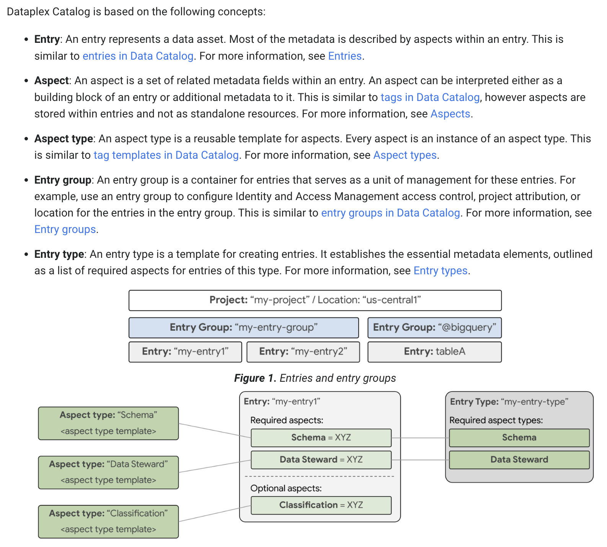

# BigQuery Data Governance

"BigQuery Data Governance" powered by Google Cloud's Dataplex, gives you a clear picture of your data. It helps you understand what your data is like and how different pieces of data connect across your Google Cloud environment, including BigQuery. In this demo, you'll see how easy it is to find your data, track its journey, and learn important details about it using Dataplex's features.

### Architecture

The architecture contains REPLACE-ME.



## Demo Cost and Usage

* **Idle Cost:** ~$1/day. Minimize by deleting the Colab Runtime and recreating when needed.
* **Notebook Execution:** ~$1 per run for GenAI and BigQuery notebooks. Costs scale with data volume.

**Usage Notes:**

* Notebooks use the latest Gemini models using JSON output.  Output may vary with model updates.  For production, pin to specific versions.
* Connect to the "colab-enterprise-runtime" within Colab.

## Notebook Deep Dive

Each notebook demonstrates a key aspect of the solution.  Explore them below:

| Title | Description | Technology | Video | Link |
|---|---|---|---|---|
| REPLACE-ME | REPLACE-ME | REPLACE-ME | Link | [Template](colab-enterprise/Template.ipynb) |


## How to deploy
The are two options to deploy the demo depending on your access privilages to your cloud organization

### Require Permissions to Deploy (2 Options)
1. Elevated Privileges - Org Level
   - **The following IAM roles are required to deploy the solution**
      - Prerequisite:  Billing Account User (to create the project with billing)
   - To deploy the code you will:
      - Run ```source deploy.sh```

2. Owner Project Privileges - Typically Requires Assistance from IT
   - **The following items are required to deploy the solution**
      - Prerequisite: You will need a project created for you (IT can do this for you)
      - Prerequisite: You will need to be an Owner (IAM role) of the project to run the below script
   - To deploy the code you will
      - Update the hard coded values in ```deploy-use-existing-project-non-org-admin.sh```
      - Run ```source deploy-use-existing-project-non-org-admin.sh```


### Using your Local machine (Assuming Linux based)
1. Install Git (might already be installed)
2. Install Curl (might already be installed)
3. Install "jq" (might already be installed) - https://jqlang.github.io/jq/download/
4. Install Google Cloud CLI (gcloud) - https://cloud.google.com/sdk/docs/install
5. Install Terraform - https://developer.hashicorp.com/terraform/install
6. Login:
   ```
   gcloud auth login
   gcloud auth application-default login
   ```
7. Type: ```git clone https://github.com/GoogleCloudPlatform/governed-data```
8. Switch the prompt to the directory: ```cd governed-data```
9. Run the deployment script
   - If using Elevated Privileges
      - Run ```source deploy.sh```
   - If using Owner Project Privileges
      - Update the hard coded values in ```deploy-use-existing-project-non-org-admin.sh```
      - Run ```source deploy-use-existing-project-non-org-admin.sh```
10. Authorize the login (a popup will appear)
11. Follow the prompts: Answer “Yes” for the Terraform approval.


### To deploy through a Google Cloud Compute VM
1. Create a new Compute VM with a Public IP address or Internet access on a Private IP
   - The default VM is fine (e.g.)
      - EC2 machine is fine for size
      - OS: Debian GNU/Linux 12 (bookworm)
2. SSH into the machine.  You might need to create a firewall rule (it will prompt you with the rule if it times out)   
3. Run these commands on the machine one by one:
   ```
   sudo apt update
   sudo apt upgrade -y
   sudo apt install git
   git config --global user.name "FirstName LastName"
   git config --global user.email "your@email-address.com"
   git clone https://github.com/GoogleCloudPlatform/governed-data
   cd governed-data/
   sudo apt-get install apt-transport-https ca-certificates gnupg curl
   sudo apt-get install jq
   gcloud auth login
   gcloud auth application-default login
   sudo apt-get update && sudo apt-get install -y gnupg software-properties-common
   wget -O- https://apt.releases.hashicorp.com/gpg | gpg --dearmor | sudo tee /usr/share/keyrings/hashicorp-archive-keyring.gpg > /dev/null
   gpg --no-default-keyring --keyring /usr/share/keyrings/hashicorp-archive-keyring.gpg --fingerprint
   echo "deb [signed-by=/usr/share/keyrings/hashicorp-archive-keyring.gpg] \
   https://apt.releases.hashicorp.com $(lsb_release -cs) main" | sudo tee /etc/apt/sources.list.d/hashicorp.list
   sudo apt update
   sudo apt-get install terraform

   source deploy.sh 
   # Or 
   # Update the hard coded values in deploy-use-existing-project-non-org-admin.sh
   # Run source deploy-use-existing-project-non-org-admin.sh
   ```

### Cloud Shell (NOT WORKING) 
1. Open a Google Cloud Shell: http://shell.cloud.google.com/
2. Type: ```git clone https://github.com/GoogleCloudPlatform/governed-data```
3. Switch the prompt to the directory: ```cd governed-data```
4. Run the deployment script
   - If using Elevated Privileges
      - Run ```source deploy.sh```
   - If using Owner Project Privileges
      - Update the hard coded values in ```deploy-use-existing-project-non-org-admin.sh```
      - Run ```source deploy-use-existing-project-non-org-admin.sh```
5. Authorize the login (a popup will appear)
6. Follow the prompts: Answer “Yes” for the Terraform approval