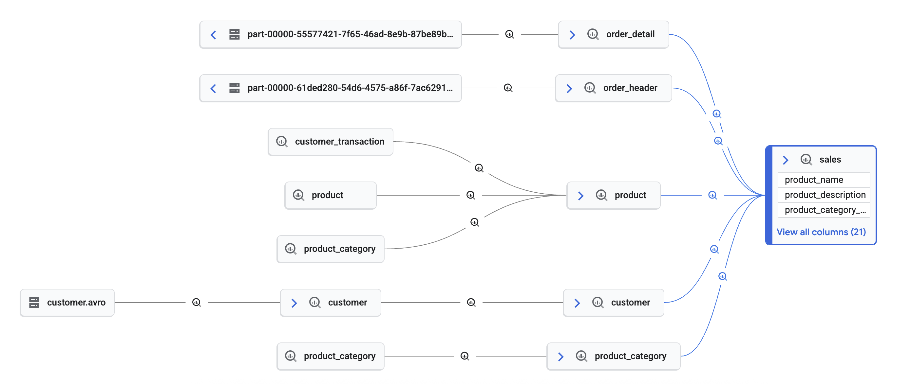

# BigQuery Data Governance

*Master your data universe with unified, intelligent governance powered by Dataplex.*

<table>
<tr>
<td width="50%">

<!-- This image should be in your demo's images subfolder -->

</a>
</td>
<td width="50%">
This demo provides a hands-on deep dive into establishing robust data governance. Learn to automatically discover, profile, and secure your data, ensuring trust and clarity from raw ingestion to curated insights across your entire data estate.
<br/><br/>
You'll see how easy it is to find your data, track its journey, and understand its statistical profile using Dataplex's powerful features integrated directly within BigQuery.
<br/><br/>
<b>Key Features:</b>
<ul>
  <li><b>End-to-End Data Lineage:</b> Trace data from its source, through Spark and BigQuery transformations, to its final destination.</li>
  <li><b>Automated Data Profiling & Quality:</b> Automatically scan tables to understand data distributions and enforce data quality rules.</li>
  <li><b>Sensitive Data Discovery (DLP):</b> Identify and classify PII and other sensitive information within your data warehouse.</li>
  <li><b>Unified Catalog & Aspect-Based Governance:</b> Create a rich, searchable catalog with custom metadata (Aspects) to tag and organize all your data assets.</li>
</ul>
<br/>
<a href="#notebook-deep-dive"><b>Explore the Notebooks Below &darr;</b></a>
</td>
</tr>
</table>

---

## Notebook Deep Dive

Each notebook provides a step-by-step guide to a specific governance capability. Run them in order for a complete end-to-end experience.

| Title                                                 | Description                                                                                                                                                                                                                            | Technology                                                    | Video | Link                                                       |
|-------------------------------------------------------|----------------------------------------------------------------------------------------------------------------------------------------------------------------------------------------------------------------------------------------|---------------------------------------------------------------|-------|------------------------------------------------------------|
| Spark Data Lineage                                    | Shows how to use Dataproc (Spark) to create Data Lineage that can be seen.                                                                                                                                                             | Dataproc, Data Lineage                                        | [Link](https://storage.googleapis.com/data-analytics-golden-demo/colab-videos/Spark-Data-Lineage.mp4)  | [Link](colab-enterprise/01-Spark-Data-Lineage.ipynb)       |
| Data Profiling                                        | Automatically generate statistical profiles for each BigQuery table, providing key insights into your data's characteristics.                                                                                                        | BigQuery, Dataplex                                            | [Link](https://storage.googleapis.com/data-analytics-golden-demo/colab-videos/Data-Profile.mp4)  | [Link](colab-enterprise/02-Data-Profile.ipynb)             |
| Data Insights                                         | Use GenAI to automatically explore each BigQuery table and create sample queries to understand data patterns and quality.                                                                                                            | BigQuery, Dataplex                                            | [Link](https://storage.googleapis.com/data-analytics-golden-demo/colab-videos/Data-Insights.mp4)  | [Link](colab-enterprise/03-Data-Insights.ipynb)            |
| Data Governance                                       | Master the process of creating and managing a comprehensive data governance model, including custom entries and associating aspect types to tables/columns. Learn how a data governance model is established in our demo, showcasing the underlying setup. | BigQuery, Dataplex                                            | [Link](https://storage.googleapis.com/data-analytics-golden-demo/colab-videos/Data-Governance.mp4)  | [Link](colab-enterprise/04-Data-Governance.ipynb)          |
| Data Quality                                          | Set up data quality checks using your Data Profiling results. Create data quality jobs for each table based upon the profiling.                                                                                                      | BigQuery, Dataplex                                            | [Link](https://storage.googleapis.com/data-analytics-golden-demo/colab-videos/Data-Quality.mp4)  | [Link](colab-enterprise/05-Data-Quality.ipynb)             |
| Data Discovery Scan                                   | Set up a discovery scan that will create BigLake tables when scanning a storage account for CSV files.                                                                                                                               | Dataplex, BigQuery,  Cloud Storage                            | [Link](https://storage.googleapis.com/data-analytics-golden-demo/colab-videos/Data-Discovery-Scan.mp4)  | [Link](colab-enterprise/06-Data-Discovery-Scan.ipynb)      |
| Sensitive Data Protection (DLP)                       | Setup a SDP scan that will detect sensitive information and send the results to a new BigQuery table to be reviewed.                                                                                                                 | Sensitive Data Protection, BigQuery                           | [Link](https://storage.googleapis.com/data-analytics-golden-demo/colab-videos/Sensitive-Data-Protection-Scan.mp4)  | [Link](colab-enterprise/07-Sensitive-Data-Protection-Scan.ipynb) |
| Column Level and Row Level Security & Data Masking    | Demonstrate policy tags for column level security and data masking at a manager and employee level as well as a separate user.  Also, applies row level security.                                                                         | BigQuery, Policy Tags                                         | [Link](https://storage.googleapis.com/data-analytics-golden-demo/colab-videos/Row-Column-Security-Data-Masking.mp4)  | [Link](colab-enterprise/08-Row-Column-Security-Data-Masking.ipynb) |
| Automated Data Governance (Aspect Tags)               | Automatically create Aspect Tags for PII and other data elements using Gemini and the sensitive data protection scan. Customers can start to automate their data governance using LLMs.                                                 | Sensitive Data Protection, BigQuery, Gemini, Aspect Tags      | [Link](https://storage.googleapis.com/data-analytics-golden-demo/colab-videos/Automated-Aspect-Data-Governance.mp4)  | [Link](colab-enterprise/09-Automated-Aspect-Data-Governance.ipynb) |

---

## How to Deploy

There are two options to deploy the demo, depending on your access privileges to your Google Cloud organization.

### Require Permissions to Deploy (2 Options)
1. **Elevated Privileges - Org Level**
   - **The following IAM roles are required to deploy the solution:**
      - Prerequisite: `Billing Account User` (to create the project with billing)
   - **To deploy the code you will:**
      - Run ```source deploy.sh```

2. **Owner Project Privileges - Typically Requires Assistance from IT**
   - **The following items are required to deploy the solution:**
      - Prerequisite: You will need a project created for you (IT can do this for you).
      - Prerequisite: You will need to be an `Owner` (IAM role) of the project to run the below script.
   - **To deploy the code you will:**
      - Update the hard-coded values in `deploy-use-existing-project-non-org-admin.sh`
      - Run ```source deploy-use-existing-project-non-org-admin.sh```

### Using your Local machine (Assuming Linux based)
1. Install Git (might already be installed)
2. Install Curl (might already be installed)
3. Install `jq` (might already be installed) - https://jqlang.github.io/jq/download/
4. Install Google Cloud CLI (`gcloud`) - https://cloud.google.com/sdk/docs/install
5. Install Terraform - https://developer.hashicorp.com/terraform/install
6. Login:   
   ```
   gcloud auth login
   gcloud auth application-default login
   ```
7. Clone the repository:
   ```
   git clone https://github.com/GoogleCloudPlatform/data-analytics-golden-demo.git
   ```
8. Switch to the demo directory:
   ```
   cd data-analytics-golden-demo/data-analytics-demos/bigquery-data-governance
   ```
9. Run the deployment script based on your permission level:
   #### If using Elevated Privileges:
   ```
   source deploy.sh
   ```

   #### If using Owner Project Privileges:
   - First, update the hard-coded values in the script
   ```
   source deploy-use-existing-project-non-org-admin.sh
   ```
10. Authorize the login when a popup appears in your browser.
11. Follow the prompts in your terminal: Answer “Yes” for the Terraform approval.

### To deploy through a Google Cloud Compute VM
1. Create a new Compute VM with a Public IP address or Internet access on a Private IP
   - The default VM is fine (e.g.)
      - EC2 machine is fine for size
      - OS: Debian GNU/Linux 12 (bookworm)
2. SSH into the machine.  You might need to create a firewall rule (it will prompt you with the rule if it times out)   
3. Run these commands on the machine one by one:
   ```
   sudo apt update
   sudo apt upgrade -y
   sudo apt install git
   git config --global user.name "FirstName LastName"
   git config --global user.email "your@email-address.com"
   git clone https://github.com/GoogleCloudPlatform/data-analytics-golden-demo
   cd data-analytics-golden-demo/
   sudo apt-get install apt-transport-https ca-certificates gnupg curl
   sudo apt-get install jq
   gcloud auth login
   gcloud auth application-default login
   sudo apt-get update && sudo apt-get install -y gnupg software-properties-common
   wget -O- https://apt.releases.hashicorp.com/gpg | gpg --dearmor | sudo tee /usr/share/keyrings/hashicorp-archive-keyring.gpg > /dev/null
   gpg --no-default-keyring --keyring /usr/share/keyrings/hashicorp-archive-keyring.gpg --fingerprint
   echo "deb [signed-by=/usr/share/keyrings/hashicorp-archive-keyring.gpg] \
   https://apt.releases.hashicorp.com $(lsb_release -cs) main" | sudo tee /etc/apt/sources.list.d/hashicorp.list
   sudo apt update
   sudo apt-get install terraform

   source deploy.sh 
   # Or 
   # Update the hard coded values in deploy-use-existing-project-non-org-admin.sh
   # Run source deploy-use-existing-project-non-org-admin.sh
   ```