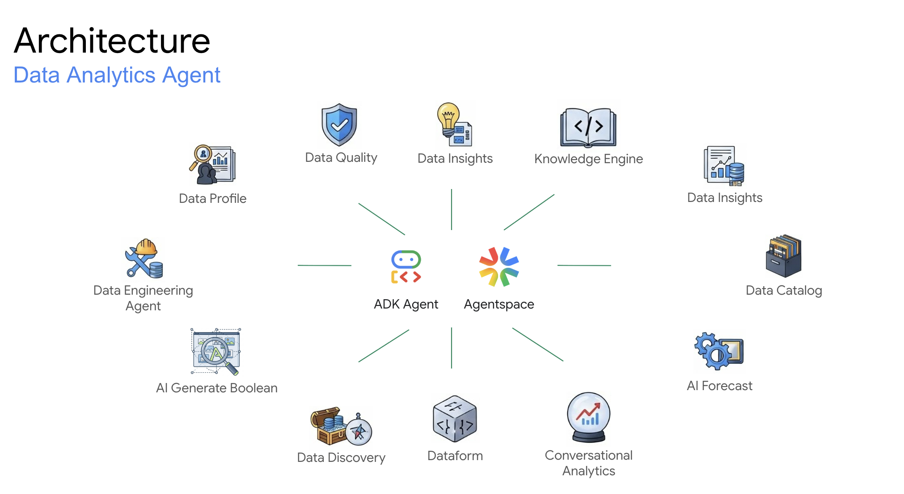

# Agentic Beans: AI Agents on Google Cloud

Unlock the full potential of your data on Google Cloud. This session unveils AI Agents, a transformative approach to data analytics that drives new levels of automation and efficiency. Join us to see these intelligent agents in action as we demonstrate:

*   **Automated Data Quality & Remediation:** How AI Agents proactively detect data inconsistencies and automatically apply corrections, ensuring pristine and trusted data streams.
*   **Metadata-Powered Agent Building:** How leveraging rich metadata enables the creation of more intelligent and capable agents, including those that translate natural language into precise SQL queries.
*   **AI-Driven Forecasting:** The power of agents to generate precise forecasts from complex datasets, anticipating future trends and informing critical business decisions.

Move beyond reactive data analytics. Learn how AI Agents empower your organization with proactive intelligence and a resilient data foundation for accelerated innovation.

NOTES:
- The notebooks will deploy EVERY time
- The Data Analytics Agent will deploy EVERY time (zip file, cloud build and cloud run)
   - You will need to delete prior revisions!
   
### Architecture

The architecture contains Data Anlaytics Agent Demo.



## Demo Cost and Usage

* **Idle Cost:** ~$4/day. Minimize by deleting the Colab Runtime and recreating when needed.
* **Notebook Execution:** <$1 per run for GenAI and BigQuery notebooks. Costs scale with data volume.

**Usage Notes:**

* Notebooks use the latest Gemini models using JSON output.  Output may vary with model updates.  For production, pin to specific versions.
* Connect to the "colab-enterprise-runtime" within Colab.

## Notebook Deep Dive

Each notebook demonstrates a key aspect of the solution.  Explore them below:

| Title | Description | Technology | Video | Link |
|---|---|---|---|---|
| Demo-Agent-Agentspace | Configures Agentspace to use the custom Data Analytics Agent. | ADK, Agentspace, Lots of BigQuery services to prompt | [Link](https://storage.googleapis.com/data-analytics-golden-demo/colab-videos/Demo-Agent-Agentspace.mp4) | [Link](colab-enterprise/Demo-Agent-Agentspace.ipynb) |
| Demo-Agent-Data-Analytics-Agent | Showcases how to use the custom Data Analytics Agent in a notebook. It allows you to talk to the agent and construct data frames from the results. | ADK, Notebooks, Lots of BigQuery services to prompt, Dataform | [Link](https://storage.googleapis.com/data-analytics-golden-demo/colab-videos/Demo-Agent-Data-Analytics-Agent.mp4) | [Link](colab-enterprise/Demo-Agent-Data-Analytics-Agent.ipynb) |
| Demo-Agent-Self-Healing-Pipeline | Demonstrates some of the code behind the self healing data pipeline using data quality and the data engineering agent. | Data Engineering Agent, Data Quality, Dataform | [Link](https://storage.googleapis.com/data-analytics-golden-demo/colab-videos/Demo-Agent-Self-Healing-Pipeline.mp4) | [Link](colab-enterprise/Demo-Agent-Self-Healing-Pipeline.ipynb) |
| Demo-Conversational-Analytics | This is a demo of Conversational Analytics API embedded into a custom UI (Colab notebook). See how to create CA agents, talk with them either in a stateful or stateless conversation, author system prompts and automatically generate CA agents using the Data Analytics Agent. | Knowledge Engine, Conversational Analytics | [Link](https://storage.googleapis.com/data-analytics-golden-demo/colab-videos/Demo-Conversational-Analytics.mp4) | [Link](colab-enterprise/Demo-Conversational-Analytics.ipynb) |
| Demo-Data-Engineering-Agent-Spark-Conversion | See notebook for details. | Data Engineering Agent | [Link](https://storage.googleapis.com/data-analytics-golden-demo/colab-videos/Demo-Data-Engineering-Agent-Spark-Conversion.mp4) | [Link](colab-enterprise/Demo-Data-Engineering-Agent-Spark-Conversion.ipynb) |
| Demo-Data-Engineering-Agent | This will show step by step using the Data Engineering Agent REST API. | Data Engineering Agent, Dataform | [Link](https://storage.googleapis.com/data-analytics-golden-demo/colab-videos/Demo-Data-Engineering-Agent.mp4) | [Link](colab-enterprise/Demo-Data-Engineering-Agent.ipynb) |
| Demo-Knowledge-Engine | This will create knowledge engine scans and business glossaries from the output of the knowledge engine scan. | Knowledge Engine, Dataplex Business Glossary | [Link](https://storage.googleapis.com/data-analytics-golden-demo/colab-videos/Demo-Knowledge-Engine.mp4) | [Link](colab-enterprise/Demo-Knowledge-Engine.ipynb) |


## How to deploy
The are two options to deploy the demo depending on your access privilages to your cloud organization

### Require Permissions to Deploy (2 Options)
1. Elevated Privileges - Org Level
   - **The following IAM roles are required to deploy the solution**
      - Prerequisite:  Billing Account User (to create the project with billing)
   - To deploy the code you will:
      - Run ```source deploy.sh```

2. Owner Project Privileges - Typically Requires Assistance from IT
   - **The following items are required to deploy the solution**
      - Prerequisite: You will need a project created for you (IT can do this for you)
      - Prerequisite: You will need to be an Owner (IAM role) of the project to run the below script
   - To deploy the code you will
      - Update the hard coded values in ```deploy-use-existing-project-non-org-admin.sh```
      - Run ```source deploy-use-existing-project-non-org-admin.sh```


### Using your Local machine (Assuming Linux based)
1. Install Git (might already be installed)
2. Install Curl (might already be installed)
3. Install "jq" (might already be installed) - https://jqlang.github.io/jq/download/
4. Install Google Cloud CLI (gcloud) - https://cloud.google.com/sdk/docs/install
5. Install Terraform - https://developer.hashicorp.com/terraform/install
6. Login:
   ```
   gcloud auth login
   gcloud auth application-default login
   ```
7. Type: ```git clone https://github.com/GoogleCloudPlatform/data-analytics-golden-demo```
8. Switch the prompt to the directory: ```cd data-analytics-golden-demo```
9. Run the deployment script
   - If using Elevated Privileges
      - Run ```source deploy.sh```
   - If using Owner Project Privileges
      - Update the hard coded values in ```deploy-use-existing-project-non-org-admin.sh```
      - Run ```source deploy-use-existing-project-non-org-admin.sh```
10. Authorize the login (a popup will appear)
11. Follow the prompts: Answer “Yes” for the Terraform approval.


### To deploy through a Google Cloud Compute VM
1. Create a new Compute VM with a Public IP address or Internet access on a Private IP
   - The default VM is fine (e.g.)
      - EC2 machine is fine for size
      - OS: Debian GNU/Linux 12 (bookworm)
2. SSH into the machine.  You might need to create a firewall rule (it will prompt you with the rule if it times out)   
3. Run these commands on the machine one by one:
   ```
   sudo apt update
   sudo apt upgrade -y
   sudo apt install git
   git config --global user.name "FirstName LastName"
   git config --global user.email "your@email-address.com"
   git clone https://github.com/googlecloudplatform/data-analytics-golden-demo
   cd data-analytics-golden-demo/
   sudo apt-get install apt-transport-https ca-certificates gnupg curl
   sudo apt-get install jq
   gcloud auth login
   gcloud auth application-default login
   sudo apt-get update && sudo apt-get install -y gnupg software-properties-common
   wget -O- https://apt.releases.hashicorp.com/gpg | gpg --dearmor | sudo tee /usr/share/keyrings/hashicorp-archive-keyring.gpg > /dev/null
   gpg --no-default-keyring --keyring /usr/share/keyrings/hashicorp-archive-keyring.gpg --fingerprint
   echo "deb [signed-by=/usr/share/keyrings/hashicorp-archive-keyring.gpg] \
   https://apt.releases.hashicorp.com $(lsb_release -cs) main" | sudo tee /etc/apt/sources.list.d/hashicorp.list
   sudo apt update
   sudo apt-get install terraform

   source deploy.sh 
   # Or 
   # Update the hard coded values in deploy-use-existing-project-non-org-admin.sh
   # Run source deploy-use-existing-project-non-org-admin.sh
   ```

### Cloud Shell (NOT WORKING) 
1. Open a Google Cloud Shell: http://shell.cloud.google.com/
2. Type: ```git clone https://github.com/googlecloudplatform/data-analytics-golden-demo```
3. Switch the prompt to the directory: ```cd data-analytics-golden-demo```
4. Run the deployment script
   - If using Elevated Privileges
      - Run ```source deploy.sh```
   - If using Owner Project Privileges
      - Update the hard coded values in ```deploy-use-existing-project-non-org-admin.sh```
      - Run ```source deploy-use-existing-project-non-org-admin.sh```
5. Authorize the login (a popup will appear)
6. Follow the prompts: Answer “Yes” for the Terraform approval