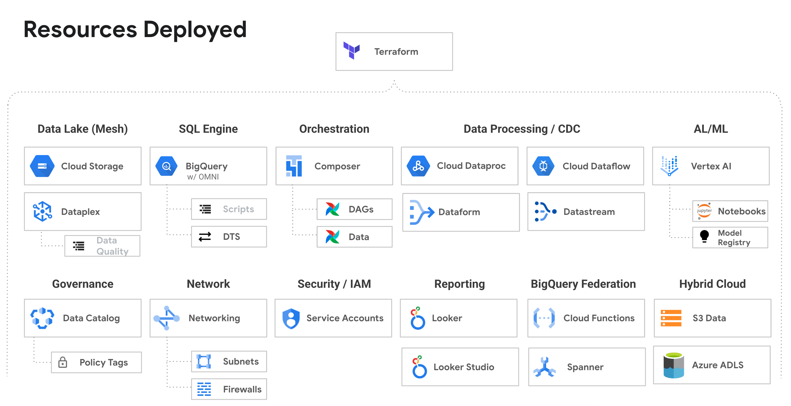

# Data Analytics Golden Demo

*The definitive, end-to-end technical walkthrough of Google Cloud's data platform.*

<table>
<tr>
<td width="50%">

</a>
</td>
<td width="50%">
This is the ultimate, hands-on demonstration for exploring Google Cloud's data analytics capabilities. It deploys a complete, interconnected environment with a massive dataset (up to 700+ million rows) to showcase real-world performance and scale.
<br/><br/>
From building a multi-cloud data lakehouse to advanced machine learning and real-time streaming, this demo provides working code and infrastructure for virtually every major data service. It's the perfect starting point to explore, customize, and master Google Cloud's data platform.
<br/><br/>
<b>Key Features:</b>
<ul>
  <li><b>Multi-Cloud Analytics:</b> Query data in AWS and Azure directly from BigQuery with Omni.</li>
  <li><b>AI & ML in BigQuery:</b> Train, import, and run models with BQML, Vertex AI, and Gemini.</li>
  <li><b>Real-Time Data Lakehouse:</b> Build end-to-end streaming pipelines with Dataflow and Datastream.</li>
  <li><b>Open Source Integration:</b> Work with Apache Iceberg, Delta Lake, and Spark (BigSpark) directly within BigQuery.</li>
  <li><b>Full Orchestration:</b> See how Cloud Composer (Airflow) manages the entire data ecosystem.</li>
</ul>
<br/>
<a href="#table-of-contents"><b>Explore All Features Below &darr;</b></a>
</td>
</tr>
</table>

---

## Table of Contents

This demo covers a vast array of features. Use this table to navigate to the specific scripts, notebooks, or procedures you want to explore.

|Category|Title|Description|Link|Video|
|---|---|---|---|---|
| Ready-To-Go Demos | Rideshare Plus (AI Lakehouse - LLMs)| A new end to end demo where we use our Gemini LLM directly within BigQuery to read customer reviews and extract various pieces of data from each review.  The data will then be used to create a complete employee and customer profile form this data.  At the same time qualitative data analysis will be done and added to each profile.  The demo highlight how LLMs can work with text data and create valuable analytics from the context.  Please view the new Cloud Run website along with the following notebook to run the demo. | [Link](colab-enterprise/rideshare_llm_ai_lakehouse_demo.ipynb) | [Video](https://youtu.be/-ka9ya_KJAc)
| | Rideshare Plus (AI Lakehouse - Predict and Streaming)|This is an end to end demo of an AI Lakehouse.  The demo goes through the creation of a fictitious company that wants to predict high value rides for rideshare drivers.  The demo takes you through the process from the raw zone to the curated zone and highlights our analytics stack.| [Link](sql-scripts/rideshare_lakehouse_curated/sp_demo_script.sql) | [Video](https://youtu.be/Yru78Pk1jMM) |
| | BigQuery Technical Overview | See some top features in BigQuery.  We will explore loading data into BigQuery, streaming data directly into BigQuery, using change data capture with BigQuery and even federated queries with Spanner.  We will then explore data governance, data quality, security and data lineage.  After we have clean and secure data we will build some machine learning models, search billions of rows and explore unstructured data analytics.  Finally, we will explore BigQuery’s serverless infrastructure which includes autoscaling along with various monitoring tools.  | [Link](sql-scripts/taxi_dataset/sp_demo_technical_overview.sql) | [Video](https://youtu.be/bMS4p2XHMpE) |
| Overview / Analytics | Analytic Queries | Use advanced SQL (rank, partition, pivot) to show BigQuery’s ability to perform analytics at scale (70 to 700 million rows of data). | [Link](sql-scripts/taxi_dataset/sp_demo_bigquery_queries.sql) | Video |
| | Materialized Views | Show using materializes to speed up your queries, provide automatically query substitution and re-clustering of data. | [Link](sql-scripts/taxi_dataset/sp_demo_materialized_views_joins.sql) | Video |
| | Transactions | Show performing a transaction with a try..catch block as well as understand snapshot isolation. | [Link](sql-scripts/taxi_dataset/sp_demo_transactions.sql) | Video |
| | Json Datatype | Show ingesting and querying JSON data in BigQuery using the  native JSON data type. | [Link](sql-scripts/taxi_dataset/sp_demo_json_datatype.sql) | Video |
| Data Ingestion / Table Creation | Ingest Data | Load (and export) data using UI, LOAD SQL command, CLI and export data. | [Link](sql-scripts/taxi_dataset/sp_demo_ingest_data.sql) | Video |
| | Streaming Ingestion | Stream data directly into BigQuery and perform machine learning on the data. | [Link](sql-scripts/taxi_dataset/sp_demo_taxi_streaming_data.sql) | Video |
| | Internal / External table join | Shows that you can join an internal and external table. | [Link](sql-scripts/taxi_dataset/sp_demo_internal_external_table_join.sql) | Video |
| | Data Transfer Service | Shows how to create and runs a DTS job that does a dataset copy from a public dataset.  All the configuration of DTS in done in the Terraform template.  This will ingest 650 million rows of data. | [Link](sql-scripts/taxi_dataset/sp_demo_data_transfer_service.sql) | Video |
| Security / Data Sharing | BigQuery Security | Show granting access to tables, row/column level security, authorized views, data masking and more. | [Link](sql-scripts/taxi_dataset/sp_demo_security.sql) | Video |
| | Column Encryption / Crypto Shredding | Show using the AEAD function for column level encryption and see how to use for crypto-shredding | [Link](sql-scripts/taxi_dataset/sp_demo_security_col_encryption_shredding.sql) | Video |
| BigSpark (Spark in BQ) | PySpark Data Export | Show running spark code in BigQuery.  This example will export data using hive partitions. | [Link](sql-scripts/taxi_dataset/sp_demo_bigspark_read_bq_save_hive_on_data_lake.py) | Video |
| | PySpark Data Import | Show Spark loading/ETL data into BigQuery.  Read a CSV file, add a column and write to BigQuery. | [Link](sql-scripts/taxi_dataset/sp_demo_bigspark_read_csv_load_bq_table.py) | Video |
| | BigSpark with Iceberg Metastore | Learn how to use Iceberg with BigLake Metastore.  This will process data and create Iceberg tables with BigSpark.  The tables will also be placed in BigQuery. | [Link](sql-scripts/rideshare_lakehouse_enriched/sp_iceberg_spark_transformation.py) | Video |
| BigQuery ML (BQML) | Anomaly Detection | Want to run Anomaly Detection on Fares to see if things are not looking right? | [Link](sql-scripts/taxi_dataset/sp_demo_machine_learning_anomaly_fee_amount.sql) | Video |
| | Jupyter Notebook Creating TensorFlow model | Use a Jupyter Notebook to create a TensorFlow that will then be imported into BigQuery. See "Importing TensorFlow model into BigQuery" to import the model. | [Link](colab-enterprise/BigQuery-Create-TensorFlow-Model.ipynb) | Video |
| | Importing TensorFlow model into BigQuery | Import a model into BigQuery, score data, compare results to notebook.  This is a great way to score data without data movement. | [Link](sql-scripts/taxi_dataset/sp_demo_machine_learning_import_tensorflow.sql) | Video |
| | Predicting Taxi Tip Amounts using Linear Regression | Predict tip amounts for each cab ride. Show how easy it is to build a quick model in BigQuery. | [Link](sql-scripts/taxi_dataset/sp_demo_machine_learning_tip_amounts.sql) | Video |
| | Easily query BigQuery from Jupyter notebooks | Data scientists need to be able to query BigQuery quickly and easily.  This shows how they can access the data in BigQuery with ease. | [Link](colab-enterprise/BigQuery-Demo-Notebook.ipynb) | Video |
| BigLake | BigLake tables with Security | See how to create a BigLake table and secure it with row and column level access. | [Link](sql-scripts/taxi_dataset/sp_demo_biglake.sql) | Video |
| | Unstructured data analytics using Object tables | See how to query and run AI on unstructured data like images stored in a data lake. | [Link](sql-scripts/taxi_dataset/sp_demo_biglake_unstructured_data.sql) | Video |
| | Iceberg & Delta.io format | See how to read open table formats like Apache Iceberg and Delta Lake directly in BigQuery. | [Link](sql-scripts/taxi_dataset/sp_demo_biglake_iceberg.sql) | [Video](https://youtu.be/wLKlR211FUc) |
| OMNI (AWS & Azure) | Cross Cloud Database Joins | Shows how we can query data in AWS/Azure and join to data in GCP using BigQuery OMNI. Also, we join to all three clouds.| [Link](sql-scripts/aws_omni_biglake/sp_demo_aws_omni_queries_cross_cloud.sql) | [Video](https://youtu.be/tHjG8tmDoWk) |
| | Row & Column Level Security | Create row and column level security on tables located in AWS S3 or Azure ADLS. | [Link](sql-scripts/aws_omni_biglake/sp_demo_aws_omni_security_rls.sql) | Video |
| Dataplex | Data Quality | Run a data quality check on your data to ensure data integrity and verify various conditions are meet. The results are then published to data catalog. | [Link](cloud-composer/dags/sample-dataplex-run-data-quality.py) | Video |
| Datastream (CDC) | Private IP Demo | Show change data capture (10 million rows) from a Cloud SQL (Postgres) database to BigQuery over Private Service Connectivity (no public IP addresses). | [Link](sql-scripts/taxi_dataset/sp_demo_datastream_private_ip.sql) | [Video](https://youtu.be/ow17MIXHOqw) |

---

## How to Deploy

There are two options to deploy the demo, depending on your access privileges to your Google Cloud organization.

### Require Permissions to Deploy (2 Options)
1. **Elevated Privileges - Org Level**
   - **The following IAM roles are required to deploy the solution:**
      - Prerequisite: `Billing Account User` (to create the project with billing)
   - **To deploy the code you will:**
      - Run ```source deploy.sh```

2. **Owner Project Privileges - Typically Requires Assistance from IT**
   - **The following items are required to deploy the solution:**
      - Prerequisite: You will need a project created for you (IT can do this for you).
      - Prerequisite: You will need to be an `Owner` (IAM role) of the project to run the below script.
   - **To deploy the code you will:**
      - Update the hard-coded values in `deploy-use-existing-project-non-org-admin.sh`
      - Run ```source deploy-use-existing-project-non-org-admin.sh```

### Using your Local machine (Assuming Linux based)
1. Install Git (might already be installed)
2. Install Curl (might already be installed)
3. Install `jq` (might already be installed) - https://jqlang.github.io/jq/download/
4. Install Google Cloud CLI (`gcloud`) - https://cloud.google.com/sdk/docs/install
5. Install Terraform - https://developer.hashicorp.com/terraform/install
6. Login:   
   ```
   gcloud auth login
   gcloud auth application-default login
   ```
7. Clone the repository:
   ```
   git clone https://github.com/GoogleCloudPlatform/data-analytics-golden-demo.git
   ```
8. Switch to the demo directory:
   ```
   cd data-analytics-golden-demo/data-analytics-demos/data-analytics-golden-dem
   ```
9. Run the deployment script based on your permission level:
   #### If using Elevated Privileges:
   ```
   source deploy.sh
   ```

   #### If using Owner Project Privileges:
   - First, update the hard-coded values in the script
   ```
   source deploy-use-existing-project-non-org-admin.sh
   ```
10. Authorize the login when a popup appears in your browser.
11. Follow the prompts in your terminal: Answer “Yes” for the Terraform approval.

### To deploy through a Google Cloud Compute VM
1. Create a new Compute VM with a Public IP address or Internet access on a Private IP
   - The default VM is fine (e.g.)
      - EC2 machine is fine for size
      - OS: Debian GNU/Linux 12 (bookworm)
2. SSH into the machine.  You might need to create a firewall rule (it will prompt you with the rule if it times out)   
3. Run these commands on the machine one by one:
   ```
   sudo apt update
   sudo apt upgrade -y
   sudo apt install git
   git config --global user.name "FirstName LastName"
   git config --global user.email "your@email-address.com"
   git clone https://github.com/GoogleCloudPlatform/data-analytics-golden-demo
   cd data-analytics-golden-demo/
   sudo apt-get install apt-transport-https ca-certificates gnupg curl
   sudo apt-get install jq
   gcloud auth login
   gcloud auth application-default login
   sudo apt-get update && sudo apt-get install -y gnupg software-properties-common
   wget -O- https://apt.releases.hashicorp.com/gpg | gpg --dearmor | sudo tee /usr/share/keyrings/hashicorp-archive-keyring.gpg > /dev/null
   gpg --no-default-keyring --keyring /usr/share/keyrings/hashicorp-archive-keyring.gpg --fingerprint
   echo "deb [signed-by=/usr/share/keyrings/hashicorp-archive-keyring.gpg] \
   https://apt.releases.hashicorp.com $(lsb_release -cs) main" | sudo tee /etc/apt/sources.list.d/hashicorp.list
   sudo apt update
   sudo apt-get install terraform

   source deploy.sh 
   # Or 
   # Update the hard coded values in deploy-use-existing-project-non-org-admin.sh
   # Run source deploy-use-existing-project-non-org-admin.sh
   ```