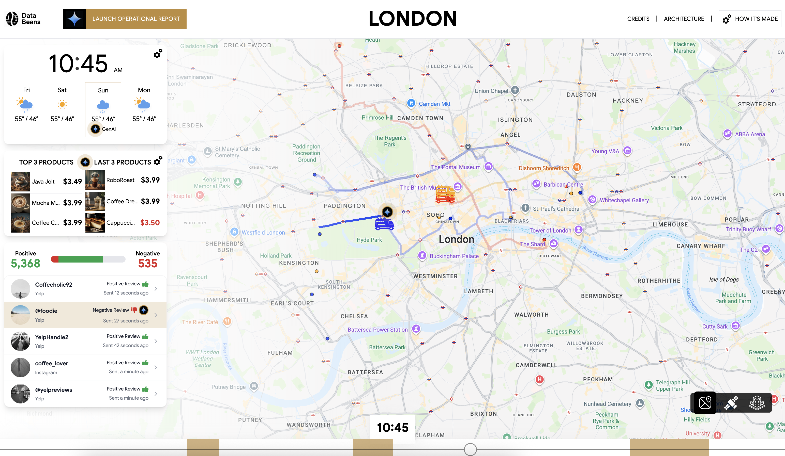

# Data Beans: Next-Generation DA & GenAI Demo

*A multi-level demonstration of data-driven hyper-personalization for a modern coffee company.*

<table>
<tr>
<td width="50%">

</td>
<td width="50%">
Data Beans is a next-generation demo showcasing a multi-level framework designed for everyone from executives to technical practitioners. Using a fictional coffee company, it demonstrates how Google Cloud technologies like BigQuery, Gemini, and Looker power data-driven campaign optimization, automated content creation, and real-time insights for hyper-personalized customer experiences.
  
<b>Key Features:</b>
<ul>
  <li><b>Multi-level Demo Framework:</b> Tailored experiences for Executive (EBC), Technical, and deep-dive "Recipe" levels.</li>
  <li><b>GenAI-Powered Personalization:</b> Automatically generate marketing campaigns, menu items, and customer responses.</li>
  <li><b>Multi-modal Data Analysis:</b> Process and analyze text, images (Vision AI), and audio reviews to understand customer sentiment.</li>
  <li><b>Interactive Analytics:</b> Explore insights through a stunning visual application and embedded Looker dashboards.</li>
</ul>
</td>
</tr>
</table>

---

### 🚀 Explore the Full Demo on GitHub

This directory is a placeholder. The complete source code, notebooks, deployment scripts, and detailed documentation are located in the main repository.

**[https://github.com/GoogleCloudPlatform/data-beans](https://github.com/GoogleCloudPlatform/data-beans)**