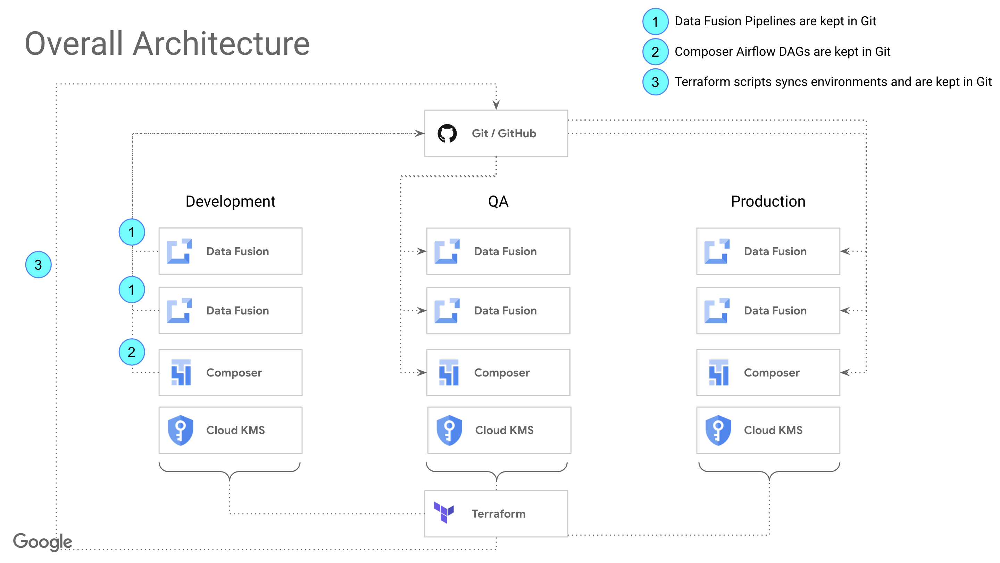
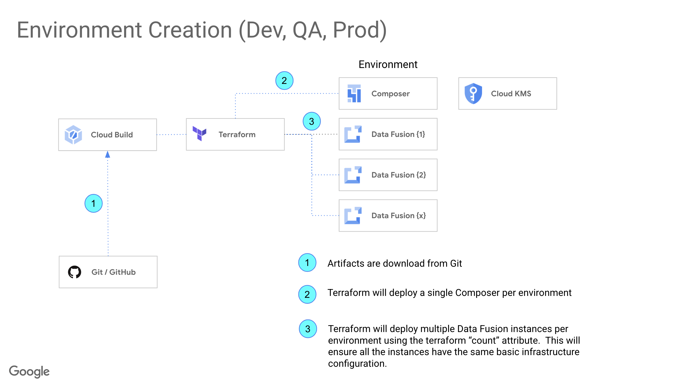
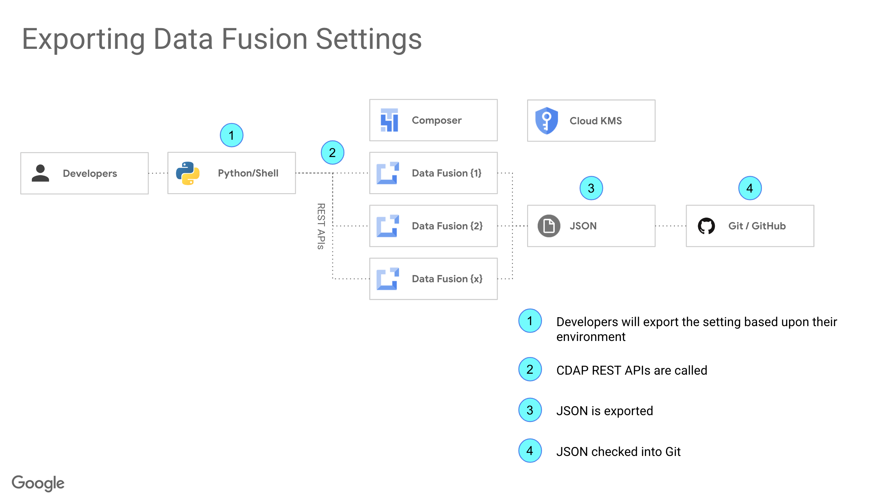
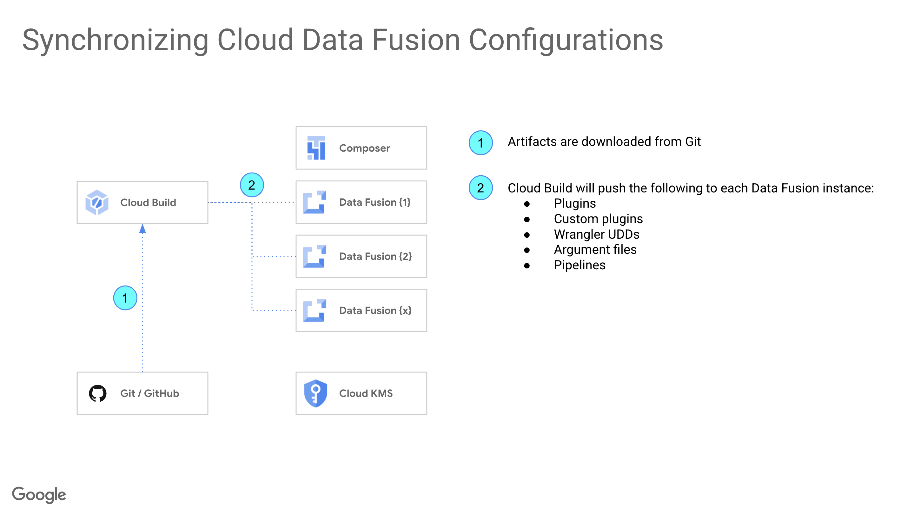

# Data Fusion
This will shows a DevOps sample using Data Fusion.  This uses the Data Fusion / CDAP REST API.

## DevOps with Data Fusion (Sample)
1. Create Data Fusion (name it e.g. df-Dev)
    - Create by hand in same region that you deploy everything else
    - Alter the DAG name in sample-create-data-fusion.py and then re-upload this DAG to the Airflow DAG folder
2. Author pipelines
    - Create a sample that copies data from one source bucket to another
3. Use the script "datafusion-download.sh" to download the namespaces, pipelines and compute profiles
    - Change to the datafusion directory and run "source datafusion-download.sh"
    - This will create a directory called system and download everything (namespaces, pipelines, compute profiles)
4. Create Data Fusion (name it e.g. df-QA)
    - Create by hand in same region that you deploy everything else
    - Alter the DAG name in sample-create-data-fusion.py and then re-upload this DAG to the Airflow DAG folder
5. Run the datafusion-deploy.sh to push out the artifacts
    - Change to the datafusion directory and run "source datafusion-deploy.sh"

## DAG sample-create-data-fusion.py
This will create a data fusion instance via the REST API (not the Airflow Operator).  The DAG will then wait for the instance to be provisioned.

## example-datafusion-create.sh
This is a non-tested shell script that will create a data fusion instance, wait for it to be created and then set the permissions required for execution.

## example-datafusion-create.tf
This is a sample Terraform script provided for you to modify

## How to use source control with Data Fusion
Currenly, you must manually export your settings from Data Fusion and deploy these settings to other environments.  This can be done by using the datafusion-download script.  You will need to add some other items in this script which are currently not downloaded.  The provide scripts are enough to get you started and are not production ready.

### Creating your environments
You can create your environemnts by hand, using Terraform, Airflow DAGs and the REST API.  If you simply have one Data Fusion instance things are realtively simple.  If you need multiple instances, then you can add automation.

### Exporting Data Fusion artifacts
Developers will need to run the download script and manually identify and copy the export JSON files to a location that has their Git mapping.  Since multiple developers can be working on the same instance, this has to be done per developer and requires the developer to know what they changed in order to check into source control.

### Pushing Data Fusion artifacts to Other Environments 
This shows once items are in source control you can push your pipelines to QA and Production.  The sample code is a full replace, not an incremenetal replace (you would need to idenifiy just the new files in that scenerio).

You should perform you upgrades in data fusion in your Dev environment and check these into source control and then then push to an upgraded QA or Production instance.  You can push to new QA / Production Data Fusion instances if you are NOT using the internal Data Fusion sceheduler.  If you are using the internal scheduler then you need to upgrade your QA and Production instances first.  Using an enternal scheduler to run your pipelines gives you some additional flexibility and keeps your Data Fusion instances "stateless".

### Notes about DevOps
- You do not need to use Cloud Build, you can use your existing DevOps tooling
- These diagrams show Composer to orchestrate the pipelines executions.  This means the internal Data Fusion is not used since you will mostlikely have other dependencies with your pipelines.
    - You can create a DAG to start a pipelines.  See the script "datafusion-start-pipeline.sh" for a sample.  Use the current data fusion DAG as your template to get an auth token to login.
- These scripts do not show parameter substition per environment
    - Cloud KMS is shown and helps with configuration values.  If all your parameters are in KMS (e.g. database names, bucket names, etc.), then when you deploy your pipelines, each data fusion points at a differnt KMS and you do not need to do lots of parameter substitions per environment.  